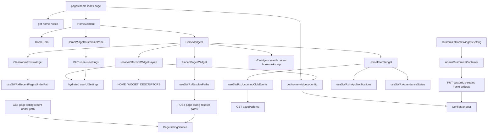
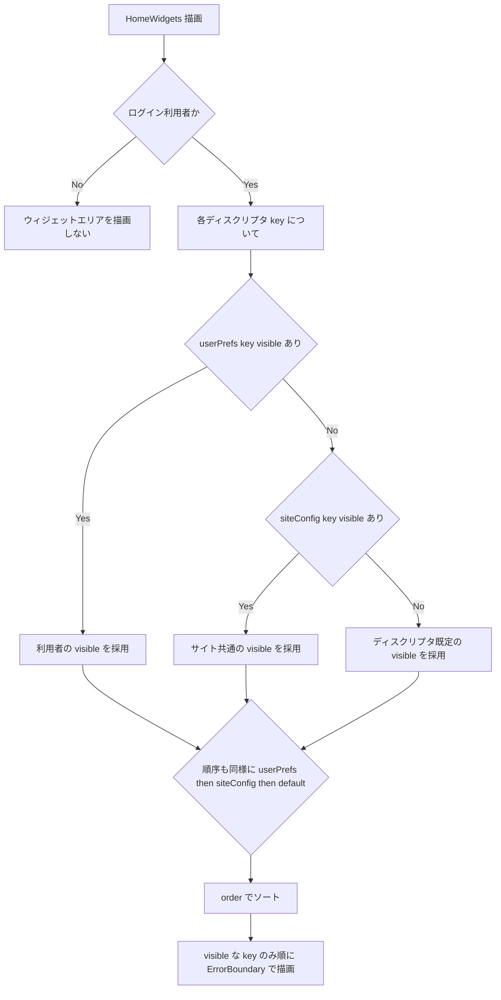
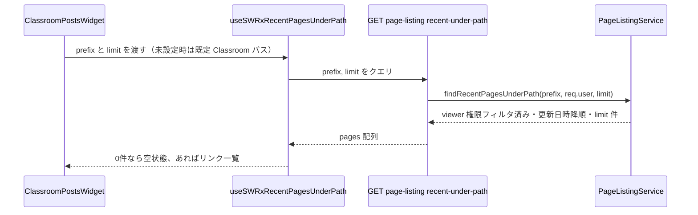

# Design Document: home-page-v3

## Overview

v2（`home-page-widgets`）で実装した `/home`（`/nas` 型の独立した非編集ページ、上部に4ウィジェット、下部にお知らせと動作環境の要件表）を拡張する。上部のウィジェットエリアに3種類のウィジェット（Classroom最新投稿・ピン留めページ・お知らせ予定フィード）を追加して計7種類とし、これまでコード固定だったウィジェットの表示/非表示と並び順を、管理者がサイト共通の初期状態として管理画面で設定でき、各利用者が自分の `/home` だけ上書きできるようにする。あわせて `/home` 画面とウィジェットカードの見た目を作り込む。

**Purpose**: ログイン利用者が `/home` で必要な情報（部の予定、自分宛の通知、Classroom のお知らせ、重要ページ）に一目でアクセスでき、各自が自分の使い方に合わせてホームを調整できるようにする。管理者は部の運用に合った既定の並びを全員に適用できる。
**Users**: 物理部 wiki のログイン利用者（ウィジェット閲覧・個人別設定）、wiki 管理者（サイト共通のウィジェット設定・ピン留めページ管理）。
**Impact**: `/home` のウィジェットエリアが「コード固定の配列」から「サイト共通設定＋個人別設定で解決される可変レイアウト」に変わる。新規の設定キー3つ、既存の1利用者設定コレクションへのフィールド1つ、`page-listing` サービスへのメソッド2つ、apiv3 ルート数本を追加する。v2 の下部セクション（お知らせ・要件表）とページの性質（非編集・ログイン後遷移先・ナビアイコン）は不変。

### Goals
- ウィジェットエリアを、v2 の4種類に v3 の3種類を加えた計7種類で構成し、v2 の個別エラー境界による障害分離を維持する
- 管理者がサイト共通のウィジェット表示状態・並び順・一部の個別オプションを管理画面で設定できる
- 各利用者が自分の `/home` だけウィジェットの表示/非表示・並び順を変更でき、その内容が利用者ごとに永続化される
- `/home` 画面にヒーロー領域とカードデザイン、画面幅に応じて折り返すグリッドレイアウトを与える
- v2 で確立した `/home` の性質を維持する

### Non-Goals
- 利用者本人の閲覧履歴・閲覧回数に基づく「よく見る/最近見たページ」（v3 では実装しない）
- Classroom API との直接連携・認可・同期処理（外部エージェントが担う。本機能は同期結果のページを読むのみ）
- 出欠確認・イベント管理・回答収集の仕組み（既存の判定結果を参照するのみ）
- ゲスト向けのウィジェット表示、下部セクションのウィジェット設定対象化
- 実行時にウィジェットの種類を追加・定義する仕組み
- lite UI ティア向けのネイティブ `/home`、トップページ（`/`）の置き換え

## Boundary Commitments

### This Spec Owns
- `/home` ウィジェットエリアの計7ウィジェットの表示ロジックと、有効レイアウト（表示対象・順序）の解決
- 新規3ウィジェット（Classroom最新投稿・ピン留めページ・お知らせ予定フィード）の表示コンポーネントとデータ取得フック
- サイト共通のウィジェット設定（`customize:homeWidgets`・`customize:homePinnedPages`・`customize:homeClassroomPathPrefix`）と、それを編集する管理画面 UI・API
- 個人別のウィジェット設定（`UserUISettings.homeWidgetPreferences`）と、それを編集する `/home` 上のカスタマイズ UI
- 「パス配下の最近更新ページ取得」「複数パスの権限フィルタ解決」の新規サーバークエリと API
- `/home` 画面の見た目（ヒーロー領域、カードグリッド）
- `/home` の予約パス化

### Out of Boundary
- Classroom 同期そのもの（外部エージェント）、同期先パスの決定（エージェント側の設定）
- 出欠確認・部イベントの管理、通知の生成（既存機能。本機能は結果を読むのみ）
- 下部のお知らせセクションと動作環境の要件表の内容・表示条件（v2 の `get-home-notice.ts` と `SystemRequirementsTable` をそのまま利用）
- ゲスト（未ログイン）のウィジェット表示（v2 と同じくウィジェットエリア自体を出さない）
- 既存の検索・最近更新・ブックマーク・書きかけウィジェットの内部実装（v2 のまま。v3 は表示可否と順序の対象に含めるだけ）
- ページ閲覧権限(ACL)、ブックマーク、書きかけ状態、全文検索、通知購読の仕組み

### Allowed Dependencies
- `server/service/page-listing`（`PageQueryBuilder` の viewer 権限フィルタ）
- `server/service/config-manager`（`customize:*` の読み書き）
- 既存の管理画面カスタマイズ設定パターン（`AdminCustomizeContainer`、`apiv3/customize-setting.js`）
- `UserUISettings` モデルとその SSR ハイドレート・`PUT /user-ui-settings` 経路
- `~/stores/in-app-notification`（`useSWRxInAppNotifications`）、`~/stores/attendance-status`、`~/stores/page-listing`、`~/stores/bookmark`
- 生 markdown 取得エンドポイント（`GET /{pagePath}.md`、`features/page-markdown`）
- `server/service/attendance-reminder.ts` の `parseEvents` 相当ロジック（共有ユーティリティに切り出して単一ソース化）
- v2 の `features/home/`（`HomeContent`、`HomeWidgets`、既存4ウィジェット、`get-home-notice.ts`）

### Revalidation Triggers
- `page-listing` サービスの viewer 権限フィルタの実装変更
- `customize:*` 管理 API の契約（リクエスト/レスポンス形状、監査アクティビティ発火方法）変更
- `UserUISettings` のスキーマ／SSR ハイドレート経路の変更
- 生 markdown エンドポイントのパス規約・認可の変更
- Classroom 同期エージェントの同期先パス規約の変更（既定パスの追随が必要）
- `attendance-status` エンドポイントの返り値、または部イベントページのパス・記法の変更

## Architecture

### Existing Architecture Analysis
- v2 の `HomeWidgets.tsx` は `WidgetEntry = { key, Component }` の**コード固定配列**を `.row`/`.col-md-4` グリッドに描画し、各ウィジェットを個別の `ErrorBoundary` で包む。`HomeContent.tsx` が `currentUser != null` の時だけ `HomeWidgets` をマウント（ログインゲート）。
- 各ウィジェットは自分の SWR フックでデータを取得し、`data == null` の間は `null` を返す。下部の `noticeMarkdown` は `getServerSideHomeNoticeProps`（config 読み取り）で SSR。
- 管理画面の設定は `config-definition.ts`（キー定義）→ `apiv3/customize-setting.js`（`PUT` ルート）→ `AdminCustomizeContainer.js`（unstated 状態）→ 個別 `CustomizeXSetting.tsx` の4層。
- 1利用者 UI 設定は `UserUISettings`（1ドキュメント、`user` unique）。SSR ハイドレート済みで `PUT /user-ui-settings` で部分更新。
- `page-listing` サービスは `PageQueryBuilder` 経由の viewer 権限フィルタ済みクエリに集約（v2 が `findWipPagesByUser` を追加）。

### Architecture Pattern & Boundary Map



**Architecture Integration**:
- 選定パターン: v2 の feature-based レイヤリングを踏襲。新しいアーキテクチャは導入しない。
- ドメイン境界: 「ウィジェット表示」（`features/home/client`）、「レイアウト解決」（`features/home` の純粋関数）、「パス系サーバークエリ」（`server/service/page-listing`）、「ウィジェット設定」（`customize-manager` + admin customize 一式、`UserUISettings`）を分離。
- 既存パターンの維持: `PageQueryBuilder` の viewer フィルタ、`customize:*` 4層、`UserUISettings` の SSR ハイドレート、v2 の個別 `ErrorBoundary`。
- 依存方向: 型/純粋関数 → Config/Model → Service → apiv3 Route → SSR props / Store（SWR） → Widget → HomeWidgets → HomeContent → Page。各層は左方向のみ import。

### Technology Stack

| Layer | Choice / Version | Role in Feature | Notes |
|-------|------------------|-----------------|-------|
| Frontend | Next.js Pages Router + React 18（既存） | `/home` ページ、ウィジェット、カスタマイズ UI、管理画面設定 | 新規追加コンポーネントのみ。DnD ライブラリは使わず上下ボタンで並び替え |
| State | SWR（既存 stores） | 各ウィジェットのデータ取得。新規 SWR フック3つ | v2 と同じパターン |
| Backend | Express + Mongoose（既存構成） | パス配下最近ページ / 複数パス解決の viewer フィルタ済みクエリ | `page-listing` サービスに2メソッド追加 |
| Config | 既存 `configManager` | `customize:homeWidgets`（オブジェクト）、`customize:homePinnedPages`（配列）、`customize:homeClassroomPathPrefix`（文字列） | `defineConfig` は構造化型をサポート済み |
| Data | MongoDB（既存 `Config` / `UserUISettings` コレクション） | サイト共通設定＝Config、個人別設定＝`UserUISettings` の新フィールド | 新規コレクションなし。スキーマ変更は `UserUISettings` に1フィールド |
| Shared | `packages/core` の予約パスユーティリティ | `/home` を作成不可パスに追加 | 1語追加 |

## File Structure Plan

### Directory Structure
```
apps/app/src/features/home/
├── widgets-registry.ts                 # 新規: HOME_WIDGET_DESCRIPTORS（7ウィジェットの固定ディスクリプタ）
├── resolve-widget-layout.ts            # 新規: resolveEffectiveWidgetLayout（純粋関数、SSR/client共用）
├── consts.ts                           # 変更: 既定 Classroom パス・既定ウィジェットレイアウトの const 追加
├── interfaces/
│   └── home-widgets.ts                 # 新規: WidgetKey / WidgetDescriptor / HomeWidgetsSiteConfig / HomeWidgetPreferences / OrderedWidgetView
├── server/
│   ├── get-home-notice.ts              # 変更なし（v2 のまま）
│   └── get-home-widgets-config.ts      # 新規: getServerSideHomeWidgetsProps（3つの customize:* を読む）
└── client/
    ├── components/
    │   ├── HomeContent.tsx             # 変更: HomeHero を追加、site config を HomeWidgets へ、カスタマイズトグルを配置
    │   ├── HomeHero.tsx                # 新規: ヒーロー領域
    │   ├── HomeWidgets.tsx             # 変更: 固定配列 → 解決済みレイアウトを描画（順序・表示可否）、ErrorBoundary は維持
    │   ├── HomeWidgetCustomizePanel.tsx# 新規: /home 上の個人別カスタマイズ（上下移動・表示トグル・初期化）
    │   └── widgets/
    │       ├── ClassroomPostsWidget.tsx   # 新規
    │       ├── PinnedPagesWidget.tsx      # 新規
    │       ├── HomeFeedWidget.tsx         # 新規（3セクション: イベント / 出欠 / 通知）
    │       └── (v2 の4ウィジェットは変更なし)
    └── utils/
        └── parse-club-events.ts        # 新規: parseEvents + CLUB_EVENTS_PAGE_PATH（client-safe、共有ソース）

apps/app/src/stores/
└── page-listing.tsx                    # 変更: useSWRxRecentPagesUnderPath / useSWRxResolvePaths を追加
apps/app/src/stores/
└── home-feed.tsx                       # 新規: useSWRxUpcomingClubEvents / useSWRxAttendanceStatus（既存 attendance-status の薄い read ラッパ）

apps/app/src/server/
├── service/page-listing/
│   ├── index.ts                        # 変更: インターフェースに2メソッド追加
│   └── page-listing.ts                 # 変更: findRecentPagesUnderPath / resolvePagesByPaths を実装
├── routes/apiv3/
│   ├── page-listing.ts                 # 変更: GET /recent-under-path, POST /resolve-paths を追加
│   └── customize-setting.js            # 変更: PUT /customize-setting/home-widgets を追加、GET 集約に3キーを含める
├── service/config-manager/
│   └── config-definition.ts            # 変更: customize:homeWidgets / homePinnedPages / homeClassroomPathPrefix を追加
├── models/user-ui-settings.ts          # 変更: homeWidgetPreferences フィールド追加
└── routes/apiv3/user-ui-settings.ts    # 変更: バリデータ配列と updateData 許可リストに homeWidgetPreferences を追加

apps/app/src/interfaces/user-ui-settings.ts   # 変更: IUserUISettings に homeWidgetPreferences 追加
apps/app/src/client/services/AdminCustomizeContainer.js  # 変更: homeWidgets 系の state / change / update を追加
apps/app/src/client/components/Admin/Customize/
├── CustomizeHomeWidgetsSetting.tsx      # 新規: 並び替え＋表示トグル＋展開式の個別オプション
└── Customize.jsx                        # 変更: 上記を配置

apps/app/src/pages/home/index.page.tsx   # 変更: Promise.all に getServerSideHomeWidgetsProps を追加
packages/core/src/utils/page-path-utils/index.ts  # 変更: restrictedPatternsToCreate に home を追加
apps/app/src/migrations/<timestamp>-warn-existing-home-page.js  # 新規: /home ページが存在すれば警告ログ（破壊しない）

apps/app/public/static/locales/{ja_JP,en_US}/  # 変更: 新ウィジェット見出し・フィード各セクション・カスタマイズ UI・admin ラベルの i18n
```

### Modified Files
- `apps/app/src/features/home/client/components/HomeContent.tsx` — `HomeHero` の追加、`homeWidgetsSiteConfig` prop を `HomeWidgets` へ受け渡し、ログイン利用者向けにカスタマイズモードのトグルを配置。ゲスト時の分岐（お知らせ＋要件表のみ）は不変。
- `apps/app/src/features/home/client/components/HomeWidgets.tsx` — 固定配列の描画をやめ、`resolveEffectiveWidgetLayout` の結果を順序どおり・`visible` のものだけ描画。各ウィジェットの `ErrorBoundary` ラップは維持。カスタマイズモード時は各カードに上下移動＋表示トグルの操作を重ねる。
- `apps/app/src/stores/page-listing.tsx` — v2 の `useSWRxMyWipPages` と同型で `useSWRxRecentPagesUnderPath(prefix, limit)` / `useSWRxResolvePaths(paths)` を追加。
- `apps/app/src/server/service/page-listing/page-listing.ts` — `findWipPagesByUser` と同型で2メソッドを実装。パス前方一致は `escapeStringForMongoRegex` でエスケープ。
- `apps/app/src/server/routes/apiv3/customize-setting.js` — `PUT /customize-setting/home-widgets`（`customize:homeWidgets` / `customize:homePinnedPages` / `customize:homeClassroomPathPrefix` の3キーをまとめて更新、監査アクティビティ発火）、`GET /customize-setting/` の返却に3キーを追加。
- `apps/app/src/pages/home/index.page.tsx` — `getServerSideProps` の `Promise.all` に `getServerSideHomeWidgetsProps` を1つ追加し `mergeGetServerSidePropsResults` で畳み込む。

## System Flows

### 有効ウィジェットレイアウトの解決



解決関数は不正な `siteConfig`（JSON 破損・未知の key）を無視してディスクリプタ既定にフォールバックする（fail-safe）。ゲストは `HomeContent` 側のログインゲートで `HomeWidgets` 自体がマウントされない。

### Classroom最新投稿ウィジェットのデータ取得



## Requirements Traceability

| Requirement | Summary | Components | Interfaces |
|-------------|---------|------------|------------|
| 1.1, 1.2 | 7ウィジェット構成・障害分離 | HomeWidgets, HOME_WIDGET_DESCRIPTORS | 各ウィジェットの ErrorBoundary ラップ（v2 踏襲） |
| 1.3, 1.4 | 表示対象0件でも崩れない・種類固定 | HomeWidgets, resolveEffectiveWidgetLayout | — |
| 2.1–2.5 | Classroom最新投稿 | ClassroomPostsWidget, PageListingService.findRecentPagesUnderPath | `GET /page-listing/recent-under-path`, `customize:homeClassroomPathPrefix` |
| 3.1–3.5 | ピン留めページ | PinnedPagesWidget, CustomizeHomeWidgetsSetting, PageListingService.resolvePagesByPaths | `customize:homePinnedPages`, `POST /page-listing/resolve-paths` |
| 4.1–4.5 | お知らせ予定フィード | HomeFeedWidget, parse-club-events, useSWRxUpcomingClubEvents | `GET /{eventsPage}.md`（既存）, `useSWRxInAppNotifications`（既存）, `GET /personal-setting/attendance-status`（既存） |
| 5.1–5.5 | 管理者のサイト共通設定 | CustomizeHomeWidgetsSetting, AdminCustomizeContainer, get-home-widgets-config, resolveEffectiveWidgetLayout | `customize:homeWidgets`, `PUT /customize-setting/home-widgets` |
| 6.1–6.5 | 利用者の個人別設定 | HomeWidgetCustomizePanel, UserUISettings.homeWidgetPreferences, resolveEffectiveWidgetLayout | `PUT /user-ui-settings`（拡張） |
| 7.1–7.4 | 見た目 | HomeHero, HomeWidgets グリッド | — |
| 8.1, 8.2 | ゲスト表示 | HomeContent（ログインゲート、v2 踏襲） | — |
| 9.1–9.4 | v2 継続性 | pages/home/index.page.tsx, HomeNavItem, login.js, get-home-notice.ts, SystemRequirementsTable（いずれも変更最小 or 不変）, restrictedPatternsToCreate | — |

## Components and Interfaces

### Summary

| Component | Domain/Layer | Intent | Req Coverage | Key Dependencies (P0/P1) | Contracts |
|-----------|--------------|--------|--------------|--------------------------|-----------|
| HOME_WIDGET_DESCRIPTORS | Shared / 型 | 7ウィジェットの固定メタデータ | 1.1, 1.4 | 各ウィジェット (P1) | — |
| resolveEffectiveWidgetLayout | Shared / 純粋関数 | サイト共通＋個人別＋既定から有効レイアウトを導出 | 1.3, 5.3, 5.4, 5.5, 6.3, 6.5 | HOME_WIDGET_DESCRIPTORS (P0) | Service |
| HomeWidgets（変更） | UI | 解決済みレイアウトを順序・可否どおりに描画、障害分離 | 1.1, 1.2, 5.3, 6.3, 7.2–7.4 | resolveEffectiveWidgetLayout (P0), 各ウィジェット (P1) | — |
| HomeWidgetCustomizePanel | UI | /home 上の個人別カスタマイズ操作 | 6.1, 6.2, 6.4 | UserUISettings 書き込み経路 (P0) | — |
| HomeHero | UI | ヒーロー領域 | 7.1 | — | — |
| ClassroomPostsWidget | UI | Classroom 由来ページの最近一覧 | 2.1–2.4 | useSWRxRecentPagesUnderPath (P0) | — |
| PinnedPagesWidget | UI | 管理者ピン留めリンク一覧 | 3.1, 3.3–3.5 | useSWRxResolvePaths (P0) | — |
| HomeFeedWidget | UI | イベント・出欠・通知の3セクション | 4.1–4.5 | useSWRxUpcomingClubEvents (P0), useSWRxInAppNotifications (P0), attendance-status read (P1) | — |
| PageListingService（拡張） | Server / Domain | パス配下最近ページ / 複数パス解決の viewer フィルタ済みクエリ | 2.1, 2.2, 3.5 | PageQueryBuilder (P0) | Service |
| `GET /page-listing/recent-under-path` | Server / API | Classroom ウィジェットへデータ提供 | 2.1 | PageListingService (P0) | API |
| `POST /page-listing/resolve-paths` | Server / API | ピン留めウィジェットへ解決済みメタ提供 | 3.3, 3.5 | PageListingService (P0) | API |
| `customize:homeWidgets` ほか設定キー | Server / Config | サイト共通設定の永続化 | 3.1, 3.2, 5.1, 5.2 | configManager (P0) | State |
| `PUT /customize-setting/home-widgets` | Server / API | サイト共通設定の更新 | 5.3 | configManager (P0) | API |
| CustomizeHomeWidgetsSetting | Admin UI | サイト共通設定の編集フォーム | 5.1, 5.2 | AdminCustomizeContainer (P0) | — |
| get-home-widgets-config | Server / SSR | サイト共通設定を初回描画へ | 5.3, 5.5 | configManager (P0) | Service |
| UserUISettings.homeWidgetPreferences | Server / Data | 個人別設定の永続化 | 6.2 | UserUISettings (P0) | State |
| parse-club-events | Shared / 純粋関数 | 部イベントページ本文のパース（単一ソース） | 4.1 | — | Service |

### Shared / 型・純粋関数

#### HOME_WIDGET_DESCRIPTORS / resolveEffectiveWidgetLayout

| Field | Detail |
|-------|--------|
| Intent | ウィジェットの種類を固定し、サイト共通・個人別・既定から「実際に描画するウィジェットと順序」を導出する |
| Requirements | 1.1, 1.3, 1.4, 5.3, 5.4, 5.5, 6.3, 6.5 |

**Responsibilities & Constraints**
- `HOME_WIDGET_DESCRIPTORS` は7エントリの固定配列。実行時の追加・変更手段を持たない（要件1.4）。
- `resolveEffectiveWidgetLayout` は純粋関数。副作用・I/O なし。SSR とクライアント再描画の両方から同じ結果を返す。
- key ごとの解決規則: `visible` / `order` とも `userPrefs[key] → siteConfig[key] → descriptor default` の順で最初に定義された値を採用。
- 不正な `siteConfig`（JSON 破損・未知の key・型不一致）は当該部分を無視してディスクリプタ既定にフォールバックする。

**Contracts**: Service [x]

##### Service Interface
```typescript
type WidgetKey =
  | 'search' | 'recentUpdates' | 'bookmarks' | 'wipPages'
  | 'classroomPosts' | 'pinnedPages' | 'homeFeed';

interface WidgetDescriptor {
  key: WidgetKey;
  titleI18nKey: string;
  Component: React.ComponentType;
  defaultVisible: boolean;
  defaultOrder: number;
  fullWidth: boolean; // search は全幅、その他はグリッドセル
}

interface WidgetPreference {
  visible: boolean;
  order: number;
}

type HomeWidgetsSiteConfig = Partial<Record<WidgetKey, Partial<WidgetPreference>>>;
type HomeWidgetPreferences = Partial<Record<WidgetKey, Partial<WidgetPreference>>>;

interface OrderedWidgetView {
  key: WidgetKey;
  Component: React.ComponentType;
  fullWidth: boolean;
}

function resolveEffectiveWidgetLayout(
  descriptors: readonly WidgetDescriptor[],
  siteConfig: HomeWidgetsSiteConfig | null | undefined,
  userPrefs: HomeWidgetPreferences | null | undefined,
): OrderedWidgetView[];
```
- Preconditions: `descriptors` は7エントリ固定。
- Postconditions: 返り値は `visible` と解決された key のみを `order` 昇順で含む。`userPrefs` が無ければサイト共通、それも無ければ既定に従う。
- Invariants: 返り値に未知の key を含まない。同じ入力に対し常に同じ順序。

### Server / Domain

#### PageListingService（`findRecentPagesUnderPath` / `resolvePagesByPaths` の追加）

| Field | Detail |
|-------|--------|
| Intent | パス前方一致の最近更新ページ、および指定パス群を viewer 権限でフィルタして返す |
| Requirements | 2.1, 2.2, 3.3, 3.5 |

**Responsibilities & Constraints**
- 既存の `PageQueryBuilder` の viewer 権限フィルタ（`addViewerCondition`）を経由する。パス一致だけで権限判定しない。
- パス前方一致の正規表現は `escapeStringForMongoRegex`（`@growi/core/dist/utils`）でエスケープする（`RegExp.escape` 不可、`.claude/rules/mongodb-regex.md`）。
- `isEmpty !== true` のページのみ対象。既存メソッドと同じ最小フィールド射影・戻り値規約（`IPageForTreeItem[]` 相当）に合わせる。
- `findRecentPagesUnderPath` は `updatedAt` 降順・`limit` 件。`resolvePagesByPaths` は入力パス配列の順序を保ち、存在しない/権限の無いパスは結果から除外する。

**Dependencies**
- Inbound: `GET /page-listing/recent-under-path`, `POST /page-listing/resolve-paths` (P0)
- Outbound: `PageQueryBuilder`（既存） (P0)

**Contracts**: Service [x]

##### Service Interface
```typescript
interface IPageListingService {
  // ...v2 までの既存メソッド...
  findRecentPagesUnderPath(
    pathPrefix: string,
    viewer: IUser | undefined,
    limit: number,
  ): Promise<IPageForTreeItem[]>;

  resolvePagesByPaths(
    paths: string[],
    viewer: IUser | undefined,
  ): Promise<IPageForTreeItem[]>;
}
```
- Preconditions: `pathPrefix` は `/` 始まりの文字列。`limit` は正の整数。`paths` は最大でも管理者が設定した件数（実用上数十件）。
- Postconditions: 戻り値は `viewer`（未指定なら匿名）が閲覧権限を持つページのみ。
- Invariants: `isEmpty === true` のページ、ゴミ箱配下のページを含まない。

#### `GET /_api/v3/page-listing/recent-under-path`

| Method | Endpoint | Request | Response | Errors |
|--------|----------|---------|----------|--------|
| GET | `/_api/v3/page-listing/recent-under-path` | クエリ `prefix: string`（省略時は既定 Classroom パス）, `limit: number`（既定・上限あり） | `{ pages: IPageForTreeItem[] }` | 401（未ログイン。既存 `loginRequiredFactory` の `/_api/*` 共通挙動により実際は 403）, 400（`prefix` が不正） |

- `loginRequiredStrictly` を通過した `req.user` を viewer として `findRecentPagesUnderPath` を呼ぶ。`prefix` は `/` 始まりを検証。

#### `POST /_api/v3/page-listing/resolve-paths`

| Method | Endpoint | Request | Response | Errors |
|--------|----------|---------|----------|--------|
| POST | `/_api/v3/page-listing/resolve-paths` | `{ paths: string[] }` | `{ pages: IPageForTreeItem[] }`（入力順、存在/権限の無いものは欠落） | 401/403（未ログイン）, 400（`paths` が配列でない・上限超過） |

- 参照系だが、多数のパスを渡すためボディを取る `POST`。監査アクティビティは発火しない（参照のみ）。

### Server / Config（サイト共通設定）

#### `customize:homeWidgets` / `customize:homePinnedPages` / `customize:homeClassroomPathPrefix`

| Field | Detail |
|-------|--------|
| Intent | サイト共通のウィジェット設定（表示状態・順序・個別オプション）を保持する |
| Requirements | 3.1, 3.2, 5.1, 5.2 |

**Responsibilities & Constraints**
- `customize:homeWidgets`: `defineConfig<HomeWidgetsSiteConfig>({ defaultValue: {} })`。key ごとの `{ visible?, order? }`。
- `customize:homePinnedPages`: `defineConfig<PinnedPageEntry[]>({ defaultValue: [] })`。`PinnedPageEntry = { path: string; label?: string }`。並び順は配列順。
- `customize:homeClassroomPathPrefix`: `defineConfig<string | undefined>({ defaultValue: undefined })`。未設定時はコード上の既定 Classroom パス（`consts.ts`）を使う。
- いずれも環境変数フォールバックを持たない（管理画面専用）。更新は管理者（`adminRequired`）のみ。

**Contracts**: API [x] / State [x]

##### API Contract
| Method | Endpoint | Request | Response | Errors |
|--------|----------|---------|----------|--------|
| PUT | `/_api/v3/customize-setting/home-widgets` | `{ homeWidgets: HomeWidgetsSiteConfig, homePinnedPages: PinnedPageEntry[], homeClassroomPathPrefix: string \| null }` | `{ customizedParams: { homeWidgets, homePinnedPages, homeClassroomPathPrefix } }` | 400（バリデーション）, 403/302（非管理者。既存 `adminRequiredFactory` の共通挙動） |

- 既存の `customize-*` ルートと同一の並び（`accessTokenParser → loginRequiredStrictly → adminRequired → addActivity → validator → apiV3FormValidator`）に従い、更新後に監査アクティビティを emit する（`.claude/rules/activity-recording.md` に従い `res.apiv3()` の前に emit）。3キーは1リクエストでまとめて更新する（保存操作が1つ）。

##### State Management
- 永続化先: 既存 `Config` コレクション。整合性は `configManager` のキャッシュ更新機構にそのまま乗る。
- クライアント側は `AdminCustomizeContainer` に `currentHomeWidgets` / `currentHomePinnedPages` / `currentHomeClassroomPathPrefix` を追加。`CustomizeHomeWidgetsSetting` が編集中の状態をローカルに保持し、保存時に3値をまとめて `updateHomeWidgets()` で送る。

#### get-home-widgets-config

| Field | Detail |
|-------|--------|
| Intent | サイト共通のウィジェット設定を `/home` の初回描画に反映する |
| Requirements | 5.3, 5.5 |

**Responsibilities & Constraints**
- `getServerSideHomeWidgetsProps(context)` は `customize:homeWidgets` / `customize:homePinnedPages` / `customize:homeClassroomPathPrefix` を同期的に読み、`{ props: { homeWidgetsSiteConfig, homePinnedPages, homeClassroomPathPrefix } }` を返す。DB クエリなし（config 読み取りのみ）。
- 個人別設定は既に `userUISettings` prop としてハイドレートされているため、この bundle には含めない。

**Contracts**: Service [x]

### Server / Data（個人別設定）

#### UserUISettings.homeWidgetPreferences

| Field | Detail |
|-------|--------|
| Intent | 各利用者のウィジェット表示状態・順序の上書きを保持する |
| Requirements | 6.2 |

**Responsibilities & Constraints**
- `homeWidgetPreferences?: HomeWidgetPreferences`（key ごとの `{ visible?, order? }`）を `UserUISettings` スキーマに追加。型は明示的なネストオブジェクト（`Schema.Types.Mixed` ではなく、key を列挙したサブスキーマまたは検証済み plain object）。
- `PUT /_api/v3/user-ui-settings` のバリデータ配列とハンドラの `updateData` 許可リストに `settings.homeWidgetPreferences` を追加（4箇所: スキーマ / `IUserUISettings` / バリデータ / `updateData`）。
- クライアントの `scheduleToPut` は浅いマージのため、部分更新でも `homeWidgetPreferences` マップ全体を送る。
- 「初期状態に戻す」は `homeWidgetPreferences` を空オブジェクト（またはキー削除）にする（要件6.4）。

**Contracts**: State [x]

##### State Management
- 永続化先: 既存 `UserUISettings` コレクション（1利用者1ドキュメント）。
- SSR: 既存の `getServerSideUserUISettingsProps` がこのフィールドも `.lean()` で拾い、`userUISettings` prop 経由でハイドレートされる。
- 並行性: 既存の `findOneAndUpdate({ user }, { $set }, { upsert })` に従う（last-write-wins）。

### UI（新規ウィジェット・カスタマイズ・見た目）

#### ClassroomPostsWidget / PinnedPagesWidget

新規の永続化・契約を持たない表示コンポーネント（サマリー行で十分）。

- **ClassroomPostsWidget**: `useSWRxRecentPagesUnderPath(prefix, limit)` の結果を更新日時降順で一覧表示。`prefix` はサイト共通設定（未設定なら既定 Classroom パス）。0件時は空状態メッセージ（要件2.1–2.4）。
- **PinnedPagesWidget**: サイト共通設定の `homePinnedPages`（`{ path, label? }[]`）を `useSWRxResolvePaths` で解決し、管理者指定順で一覧表示。ラベル未指定時はページタイトル。1件も設定が無ければ、管理者にのみ設定を促す案内、それ以外の利用者にはこのウィジェットを非表示扱い（`resolveEffectiveWidgetLayout` に「空かつ非管理者なら描画しない」判定を持たせるのではなく、ウィジェット自身が `null` を返し、`HomeWidgets` はそれを許容する）。存在しない/権限の無いパスは解決結果に含まれない（要件3.1, 3.3–3.5）。

#### HomeFeedWidget

| Field | Detail |
|-------|--------|
| Intent | 部の今後のイベント・利用者本人の未回答出欠・直近の通知を1つのフィードにまとめて表示する |
| Requirements | 4.1–4.5 |

**Responsibilities & Constraints**
- 3セクション（「今後のイベント」「未回答の出欠確認（あるときのみ）」「直近の通知」）を持つ。各セクションのデータ取得は独立し、1セクションの失敗が他セクションの表示を妨げない。
- 「今後のイベント」: `useSWRxUpcomingClubEvents()` — 生 markdown エンドポイントで部イベントページ本文を取得し、`parse-club-events` でパースして開催日の近い順に一定件数。項目クリックでイベントページへ遷移。
- 「未回答の出欠確認」: attendance-status の `answered` を読み、`false` のときのみ回答先（`ATTENDANCE_PAGE_PATH` 相当）への導線を表示。
- 「直近の通知」: `useSWRxInAppNotifications(limit)` の `docs` を新しい順に一定件数。項目クリックで対象ページへ遷移。
- 3セクションすべてに表示すべきものが無ければ、ウィジェット全体の空状態メッセージ（要件4.5）。

**Implementation Notes**
- Integration: `useSWRxInAppNotifications` / attendance-status は既存フックをそのまま利用。`parse-club-events` は `attendance-reminder.ts` からも import して単一ソース化。
- Validation: `parse-club-events` は末尾のナビゲーションフッターを含む本文でも日付行のみをマッチする（既存 `parseEvents` の挙動）。
- Risks: 既存の `AttendanceReminderModal` と出欠案内が二重に見える。フィード側は控えめな1行の受動的リマインダーにとどめ、モーダルの抑制ロジックには関与しない。

#### HomeWidgets（変更）/ HomeWidgetCustomizePanel / HomeHero

- **HomeWidgets**: `resolveEffectiveWidgetLayout(HOME_WIDGET_DESCRIPTORS, homeWidgetsSiteConfig, userUISettings?.homeWidgetPreferences)` の結果を、`fullWidth` は1列、それ以外は画面幅に応じて折り返すグリッド（v2 の `.row`/`.col-md-*` を拡張）に描画。各ウィジェットは個別 `ErrorBoundary`（v2 踏襲）。表示対象0件でもレイアウトを崩さない（要件1.3, 7.4）。
- **HomeWidgetCustomizePanel**: `/home` 上のカスタマイズモード。各ウィジェットカードに「上へ / 下へ / 表示・非表示」の操作を重ね、「初期状態に戻す」ボタンを持つ。変更は有効マップ全体をローカル state で保持し、`PUT /user-ui-settings` で `homeWidgetPreferences` マップ全体を送る。DnD ライブラリは使わない。
- **HomeHero**: wiki 名・簡単な説明を表示するヒーロー領域（要件7.1）。`appTitle` は既存 prop を利用。

**Implementation Notes（UI 共通）**
- Integration: `HomeContent` が SSR の `homeWidgetsSiteConfig` / `homePinnedPages` / `homeClassroomPathPrefix` と、ハイドレート済み `userUISettings` を受け取り、`HomeWidgets` と各ウィジェットへ配る。
- Validation: 新ウィジェットの追加は `HOME_WIDGET_DESCRIPTORS` に1エントリと、対応する `WidgetKey` の追加のみで完結する。
- Risks: カスタマイズモードでの並び替え中に SWR の再フェッチでカードが一瞬消える → v2 同様「data == null の間は null を返す」を維持しつつ、カスタマイズモードではカードの枠（見出し）だけは常に描画してレイアウトを保つ。

### Admin UI

#### CustomizeHomeWidgetsSetting

| Field | Detail |
|-------|--------|
| Intent | サイト共通のウィジェット設定を管理画面で編集する |
| Requirements | 5.1, 5.2 |

**Responsibilities & Constraints**
- 7ウィジェットを一覧表示し、各行に「上へ / 下へ / 表示・非表示」。展開すると、対象ウィジェットの個別オプション（ピン留めページの一覧エディタ、Classroom の取得元パス、リスト系ウィジェットの表示件数）を編集できる。
- `withUnstatedContainers(_, [AdminCustomizeContainer])` で v2 の `CustomizeHomeNoticeSetting` と同じ組み込み方。編集中の状態はコンポーネントのローカル state。保存ボタンで `AdminCustomizeContainer.updateHomeWidgets()`（3値をまとめて `PUT /customize-setting/home-widgets`）。
- `Customize.jsx` に1行追加して配置。

**Implementation Notes**
- Integration: `AdminCustomizeContainer.retrieveCustomizeData()` が `GET /customize-setting/` から3キーを拾って `currentHomeWidgets` 等に載せる。
- Validation: ピン留めページのパスは非空・`/` 始まりを軽く検証（存在チェックは保存時ではなくウィジェット表示時に `resolvePagesByPaths` が担う）。
- Risks: `AdminCustomizeContainer` は手書きの `currentX`/`changeX`/`updateX` パターン。構造化エディタは自前のローカルフォーム state を持ち、`change` は保存直前に1回だけ呼ぶ形にして肥大化を避ける。

## Data Models

### Logical Data Model
- 新規コレクションなし。
- `Config` コレクションに3つの新しいキー: `customize:homeWidgets`（オブジェクト）、`customize:homePinnedPages`（配列）、`customize:homeClassroomPathPrefix`（文字列）。
- `UserUISettings` コレクションに1フィールド追加: `homeWidgetPreferences`（key ごとの `{ visible?: boolean; order?: number }`）。
- `Page` コレクションのスキーマ変更なし（Classroom・ピン留めウィジェットは既存ページを読み取るのみ）。

### Data Contracts & Integration
- `PinnedPageEntry = { path: string; label?: string }`。
- `HomeWidgetsSiteConfig` / `HomeWidgetPreferences` = `Partial<Record<WidgetKey, Partial<{ visible: boolean; order: number }>>>`。
- 生 markdown エンドポイントのレスポンスは `text/markdown`（本文＋ナビゲーションフッター）。`parse-club-events` はこの形式を前提にする。

## Error Handling

### Error Strategy
- **ウィジェット単体の取得/描画エラー**: v2 同様、各ウィジェットを個別 `ErrorBoundary` で包み、エラー時はそのウィジェット領域のみエラー表示。ページ全体・他ウィジェットは継続（要件1.2）。
- **有効レイアウト解決の失敗**: `customize:homeWidgets` の JSON 破損・未知 key は無視し、ディスクリプタ既定にフォールバック（要件5.5 の「一度も保存していない場合」と同じ既定へ収束）。
- **フィードウィジェットのセクション別失敗**: イベント・出欠・通知の各取得は独立。1つが失敗しても他セクションは表示し、失敗セクションは空扱い。
- **管理設定の更新エラー**（400/403）: 既存の admin customize フォームと同様、フォームレベルのバリデーション表示・トースト通知。
- **個人別設定の保存失敗**: トースト通知。ローカルの編集内容は保持し、再保存できる。

### Monitoring
- サイト共通設定の更新は監査アクティビティに記録される（既存の customize 設定と同様）。
- 予約パス化のマイグレーション/起動時チェックは、`/home` ページが存在する場合に警告ログを出す（破壊はしない）。

## Testing Strategy

- **Unit Tests**:
  - `resolveEffectiveWidgetLayout` — 既定のみ / サイト共通で順序・非表示を上書き / 個人別が優先 / 個人別で「サイト共通が非表示にしたウィジェット」を表示に戻せる / `siteConfig` 破損時は既定へフォールバック（5.3, 5.4, 5.5, 6.3, 6.5）
  - `parse-club-events` — 日付行のパース、年跨ぎ推定、ナビゲーションフッター混在でも日付行のみ抽出（4.1）
  - `PageListingService.findRecentPagesUnderPath` — 前方一致、非ASCIIを含むパスの正規表現エスケープ、viewer 権限フィルタで見えないページを除外、更新日時降順・limit（2.1, 2.2）
  - `PageListingService.resolvePagesByPaths` — 入力順保持、存在しない/権限の無いパスの除外（3.5）
- **Integration Tests**:
  - `GET /page-listing/recent-under-path` — 未ログイン拒否、`prefix` 未指定で既定パス、viewer フィルタ済み結果（2.1, 2.2）
  - `POST /page-listing/resolve-paths` — 非管理者でも自分の権限でフィルタ、配列でないボディは 400（3.3, 3.5）
  - `PUT /customize-setting/home-widgets` — 非管理者拒否、3キーがまとめて永続化、監査アクティビティ発火（5.3）
  - `PUT /user-ui-settings` — `homeWidgetPreferences` が永続化され、当該利用者にのみ反映、マップ全体送信で上書き（6.2）
  - `getServerSideHomeWidgetsProps` — 3キー未設定時に既定値を返す（5.5）
- **E2E/UI Tests**:
  - 管理者がウィジェットの順序を変更し1つを非表示 → 個人別未設定の利用者の `/home` に反映（5.3）
  - 利用者が自分の `/home` でウィジェットを並べ替え・非表示 → リロード後も維持（6.2）
  - 利用者が「初期状態に戻す」→ サイト共通設定に従った状態に戻る（6.4）
  - ゲストが `/home` を開く → ウィジェットエリア非表示、お知らせ＋要件表のみ（8.1, 8.2）
  - 新3ウィジェットが、内容ありのときと空のときにそれぞれ正しく表示される（2.4, 3.4, 4.5）
  - `/home` が引き続き非編集ページとして表示され、ログイン後遷移先・ナビアイコンが機能する（9.1–9.3）

## Migration Strategy

- 単一フェーズ。スキーマ移行なし（`UserUISettings` へのフィールド追加は後方互換。未設定利用者はサイト共通設定に従う）。
- `restrictedPatternsToCreate` への `home` 追加に伴い、起動時チェック（マイグレーション）で `/home` にページが存在すれば警告ログを出す。自動削除・自動リネームはしない。
- ロールバック: 新設定キーは未設定なら既定にフォールバックするため、コードを戻せば v2 の固定レイアウトに戻る。`UserUISettings.homeWidgetPreferences` は参照されなくなるだけで害はない。
