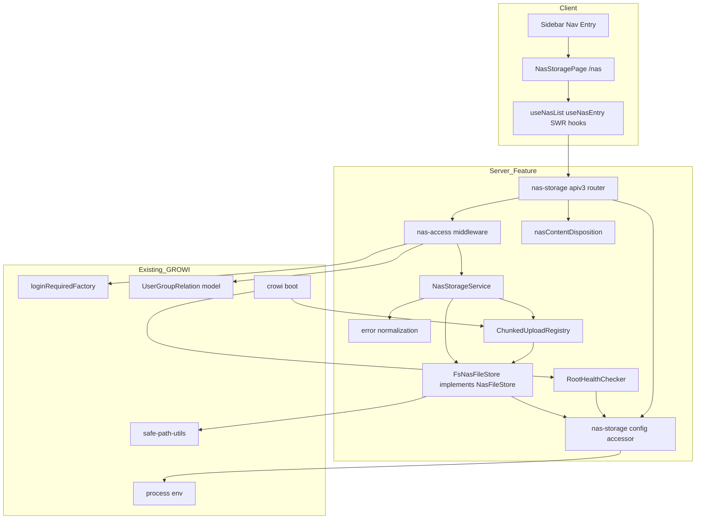
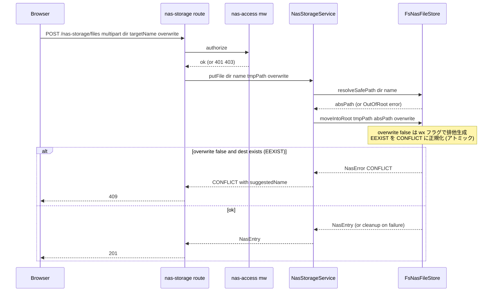
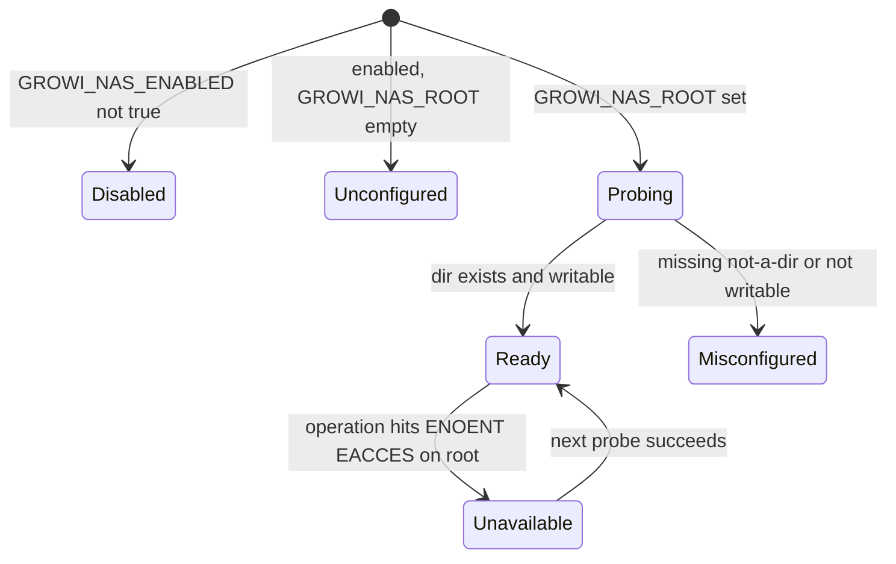
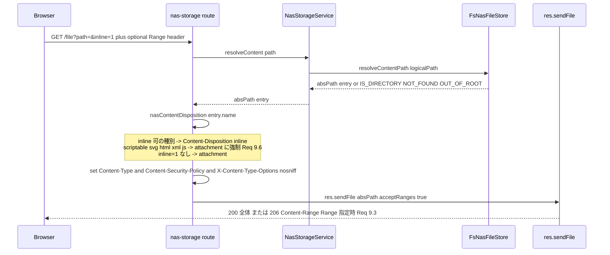
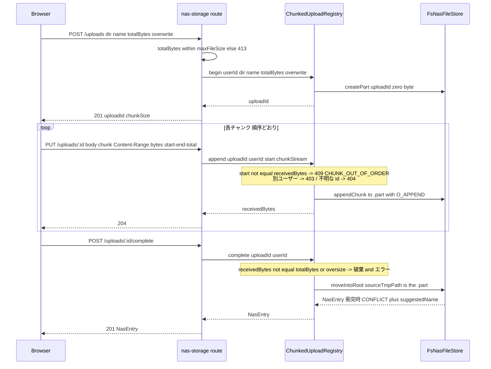

# Design Document — nas-file-storage

## Overview

**Purpose**: GROWI フォークに、ページ添付とは完全に独立した共有ファイル置き場（「NAS もどき」）をサイト内 UI として提供する。管理者が環境変数で指定した単一ルートディレクトリ配下を、ログイン済みユーザーがブラウザからフォルダ階層をたどって閲覧・アップロード・ダウンロード・整理できる。

**Users**: GROWI フォークの運用管理者（ルート設定・アクセス範囲の決定）と、ログイン済みの一般利用者（ファイルの共有・取得・整理）。

**Impact**: 新規 feature `features/nas-file-storage/` を追加する。既存の添付ストレージ（`FILE_UPLOAD` / `Attachment` / `server/service/file-uploader/`）には一切変更を加えない。既存ファイルへの変更は「apiv3 ルーター登録 2 行」「サイドバーナビ 1 項目」「crowi ブート時の feature 初期化 1 行」「サーバー設定 atom の追加」に限定する。

**日常利用の拡張（第 2 弾、Requirement 9〜11）**: 一覧上のファイルをダウンロードせずにブラウザ内で確認するプレビュー、前段プロキシ/CDN の 1 リクエスト上限を超える単一ファイルの分割アップロード、サブフォルダを含むフォルダの一括アップロードを追加する。いずれも既存レイヤー（`FsNasFileStore` / `NasStorageService` / `setupNasStorage` ルーター / `NasUploadDropzone`）の拡張として feature 内に閉じる。既存ファイルへの新たな改変は増やさない。

### Goals
- ファイルシステムを唯一の信頼源とし、GROWI を経由せず配置されたファイル/フォルダも同じ一覧に現れる（Req 2）。
- すべてのパス操作をルート配下に封じ込め、シンボリックリンクを含む範囲外アクセスを構造的に拒否する（Req 3.5 / 4.3 / 5.5 / 6.5 / 6.7 / 9.7 / 10.x / 11.5）。
- 既存の GROWI ログインセッションを唯一の認証手段とし、領域全体で一律のアクセス制御を適用する（Req 6）。
- 既存添付機構への副作用ゼロを構造（別 feature・別ルート・別保存先）で保証する（Req 7）。
- プレビュー配信でスクリプト実行可能形式（SVG・HTML 等）をブラウザ内で実行させない（Req 9.6）。
- 分割アップロードは中断時に部分データを残さず、途中再開しない（Req 10.2 / 10.3 / 10.4）。

### Non-Goals
- WebDAV / OS ドライブマウント、S3 等の非 FS バックエンド（`NasFileStore` インターフェイスで差し替え口だけ残す。実装しない）。
- サムネイル（縮小画像）生成、写真ギャラリー表示、全文検索インデックス。既存フォーマットのブラウザ内プレビュー（Req 9）は対象に含む。
- 分割アップロードの途中再開（レジューム）。中断時は最初からのやり直しとする（Req 10.4）。分割アップロードセッションは在メモリ管理で、プロセス再起動で失われてよい。
- バージョニング・重複排除・差分同期。
- フォルダ単位 ACL、未ログイン向け公開共有リンク。
- NAS 書き込み操作の監査ログ（`Activity`）記録（`research.md` の Open Question として設計フェーズ後に再検討）。
- ルート設定・グループ限定の管理画面からの編集（環境変数のみ。管理画面は読み取り専用の状態表示）。
- プレビュー用のトランスコード・レンダリング（動画変換・Office 文書変換等）。ブラウザがそのまま解釈できる形式のみを配信する。

## Boundary Commitments

### This Spec Owns
- 環境変数 `GROWI_NAS_ENABLED`（明示 opt-in の master スイッチ、既定 false）/ `GROWI_NAS_ROOT` / `GROWI_NAS_GROUP` / `GROWI_NAS_MAX_FILE_SIZE` / `GROWI_NAS_SHOW_HIDDEN` / `GROWI_NAS_MAX_ENTRIES_PER_DIR` の定義と解決（`process.env` を直接読む）。第 2 弾で新しい環境変数は追加しない。
- ルートディレクトリの健全性判定（存在・ディレクトリであること・読み書き可否）とその状態の公開。
- `GROWI_NAS_ROOT` 配下のファイル/フォルダに対する列挙・読み取り・書き込み・作成・改名・移動・削除の全操作。
- ルート配下のファイルの HTTP 配信（ダウンロード＝`attachment`、プレビュー＝`inline`）。配信時の内容種別（Content-Type）と `Content-Disposition` の判定、スクリプト実行可能形式の `attachment` 強制、Range 応答（Req 4 / 9）。
- 分割アップロードのプロトコル（`Content-Range` による逐次追記）とセッション管理、その一時データを置く `${GROWI_NAS_ROOT}/.growi-nas-tmp/` の所有と掃除（Req 10）。
- フォルダ一括アップロードのクライアント側オーケストレーション（ツリー走査・ディレクトリ再現・バッチ一律の衝突方針）。サーバー側は既存の `/folders` `/files` を再利用する（Req 11）。
- NAS 操作用の apiv3 エンドポイント群（`/api/v3/nas-storage/*`）とその認可（ログイン必須＋任意の単一グループ限定＋全操作でのパス範囲検証。プレビュー配信・分割アップロードの各リクエストを含む）。
- NAS ブラウザ画面（`/nas`）とサイドバーナビ項目の表示条件。
- クライアントに機能有効状態を伝えるためのフラグ（`RootHealthChecker.getStatus()` から導出し、`_app` のサーバー設定 props 経由で `nasStorageEnabledAtom` に供給）。

### Out of Boundary
- 既存の添付ファイル機構（`Attachment` モデル、`server/service/file-uploader/`、`/api/v3/attachment/*`、`FILE_UPLOAD` 系設定）。本 spec はこれらを読み書きも変更もしない。
- `GROWI_NAS_ROOT` に割り当てる実ストレージ（NAS マウント、ディスク容量確保、バックアップ、マウント監視）の運用。
- GROWI のログイン/セッション機構そのもの（既存の `loginRequiredFactory` を利用するのみ）。
- ユーザーグループの定義・編集（既存の `UserGroup` / `ExternalUserGroup` を参照するのみ）。
- ルート配下に GROWI 外で加えられた変更の検知通知・リアルタイム同期。

### Allowed Dependencies
- `process.env` の直接読み出し（`NasStorageConfig` アクセサ内に限定）。`configManager` / `config-definition.ts` は使わない — 設定は環境変数のみ・DB 上書き不可という Non-Goals を守るため。
- `~/server/middlewares/login-required`（`loginRequiredFactory`）— 認証ゲート。
- `~/server/util/safe-path-utils`（`isPathWithinBase`, `assertFileNameSafeForBaseDir`）— パス範囲検証。
- `~/server/models/user-group-relation` 相当（既存モデル）— 単一グループ限定判定の user 展開。
- `multer`（既存依存、`server/routes/apiv3/attachment.js` と同じ受信パターン）。
- Express の `res.sendFile`（フレームワーク組み込み）— Range / 条件付き GET / Content-Type 判定を委譲（自前で `range-parser` + 206 を書かない）。
- `node:crypto`（標準）— 分割アップロードの `uploadId` 生成。
- `~/utils/logger`（`loggerFactory`）。
- Node 標準 `node:fs` / `node:fs/promises` / `node:path` のみ（追加の外部ランタイム依存なし）。
- クライアント: 既存の SWR / Jotai パターン、`reactstrap`（`Modal` 系、既存依存）、`react-dropzone`（既存依存）、File System Access API（`showDirectoryPicker`、対応ブラウザのみ）と `<input webkitdirectory>`（フォールバック）、`~/states/context`、既存サーバー設定 atom 群。

### Revalidation Triggers
- `/api/v3/nas-storage/*` のリクエスト/レスポンス契約の形状変更。
- 環境変数名・意味の変更（特に `GROWI_NAS_ROOT` の解決規則）。
- 認可条件の変更（ログイン必須の緩和、グループ限定の粒度変更、共有リンク導入）。
- `NasFileStore` インターフェイスのメソッドシグネチャ変更（将来の S3 実装が依存）。
- プレビュー配信のディスポジション判定表（拡張子 → `inline`/`attachment`）の変更。特に新しい形式を `inline` 側へ移すとき。
- 分割アップロードのプロトコル（`Content-Range` 逐次追記の契約、`uploadId` の扱い）の変更。
- `.growi-nas-tmp/` の用途・掃除ポリシーの変更。
- FS を信頼源とする前提の変更（DB インデックス導入など）。
- crowi ブートシーケンスへのフック位置の変更。

## Architecture

### Existing Architecture Analysis

- **添付ストレージとの分離**: 既存の `FileUploader` 抽象は `Attachment` ドキュメント（ページ/コメント紐付け必須）と `MongoDB` 前提に密結合しており、フォルダ階層・FS 信頼源という本要件と噛み合わない。拡張ではなく別 feature として新設する（`research.md` Option B）。
- **feature 配置の前例**: `features/growi-vault/` が「独自ルート + 管理画面 + 設定サービス + クライアント」を feature 配下に完結させ、既存改変を `apiv3/index.js` の登録行と `crowi/index.ts` の初期化 1 行に留めている。同じ構造を踏襲する。
- **維持する統合点**: apiv3 のルーターファクトリ規約（`setupXxx(crowi): Router`）、`loginRequiredFactory` によるゲート、Next.js Pages Router の `*.page.tsx` + `getLayout`、サイドバーナビの条件表示（`PrimaryItems.tsx` の atom 参照パターン）。設定は `configManager` を使わず `process.env` を直接読む（env 専用の意図。既存の `defineConfig` キーは DB 上書き可能なため不採用）。
- **native ESM 制約**: `enum` 禁止（const union で代替）、no-extension import、サービスは `Crowi` クラスを import せずインスタンスを引数で受ける。`node:fs` のみ使用のため `no-eager-*-imports` drift spec の新規追加は不要。

### Architecture Pattern & Boundary Map



**Architecture Integration**:
- **Selected pattern**: レイヤード（Types → Config → Store → Service → Route/Middleware → Client）。単一責務の薄いコンポーネントを縦に積む。
- **Domain/feature boundaries**: すべて `features/nas-file-storage/` に閉じる。既存コードは「登録行」のみ変更。
- **Existing patterns preserved**: apiv3 ルーターファクトリ、`loginRequiredFactory`、SWR/Jotai、`*.page.tsx`。
- **New components rationale**: `NasFileStore` インターフェイス（将来 S3 差し替え口／単体テストの差し替え点）、`FsNasFileStore`（唯一の実装）、`NasStorageService`（認可済み前提のユースケース調停＋エラー正規化）、`nas-access` ミドルウェア（Req 6 の一律認可）、`RootHealthChecker`（Req 1.3 / 8.1）。
- **Steering compliance**: 多数の小さいファイル、named export、`Crowi` 非 import、erasable syntax。

### Dependency Direction (enforced)

```
interfaces  →  config  →  store (fs)  →  service  →  routes / middleware  →  client
```
各レイヤーは左側のみを import する。`store` は `service` を知らない。`client` はサーバーモジュールを import しない（`interfaces/` は型に加え、`node:*` を一切 import しない client-safe な純データ／純関数のみ共有可 — 既存の `nas-entry.ts` と同じ扱い）。`nasContentDisposition` と `ChunkedUploadRegistry` は service レイヤー、`nasContentDisposition` は routes からも直接呼ばれる（純関数）。`interfaces/nas-preview.ts`（拡張子 → `{ kind, mimeType, disposition }` の `const` 表、import なし）は client の `getNasPreviewKind` と server の `nasContentDisposition` が共有する唯一の情報源。

### Technology Stack

| Layer | Choice / Version | Role in Feature | Notes |
|-------|------------------|-----------------|-------|
| Frontend | React 18 + Next.js 16 Pages Router（既存） | `/nas` ブラウザ画面、SWR フック | 新規ライブラリなし |
| Backend | Express（既存）+ `multer`（既存依存） | apiv3 ルーター、multipart 受信 | `attachment.js` と同じ `multer({ dest })` |
| Data / Storage | Node `node:fs` / `node:fs/promises`（標準） | ルート配下の実ファイル操作。**MongoDB モデルなし** | FS が唯一の信頼源 |
| Infrastructure / Runtime | `GROWI_NAS_*` 環境変数 6 種（master スイッチ `GROWI_NAS_ENABLED` 含む）、crowi ブートフック | ルート解決・健全性判定 | 追加コンテナ・追加サービスなし。`configManager` 非経由 |

## File Structure Plan

### Directory Structure
```
apps/app/src/features/nas-file-storage/
├── index.ts                                  # feature barrel: initializeNasFileStorage, route factories
├── interfaces/
│   ├── index.ts                              # barrel
│   ├── nas-entry.ts                          # NasEntry, NasEntryType, NasListPage (client-safe types)
│   ├── nas-store.ts                          # NasFileStore interface + operation input/result types (+ resolveContentPath, chunked-upload inputs)
│   ├── nas-preview.ts                        # NasPreviewKind union + extension -> { kind, mimeType, disposition } table (client-safe, shared by server route and client)
│   ├── nas-chunked-upload.ts                 # ChunkedUploadSession shape, begin/append/complete request+response types
│   └── nas-errors.ts                         # NasErrorCode union (+ UPLOAD_SESSION_NOT_FOUND, CHUNK_OUT_OF_ORDER), NasError shape, NasResult<T>
├── server/
│   ├── index.ts                              # server barrel: initializeNasFileStorage(crowi), setupNasStorage(crowi), setupNasStorageAdmin(crowi)
│   ├── config/
│   │   └── nas-storage-config.ts             # typed accessor over process.env (GROWI_NAS_*); resolveRoot()
│   ├── store/
│   │   ├── fs-nas-file-store.ts              # FsNasFileStore: the only NasFileStore implementation (+ resolveContentPath, .part append/finalize)
│   │   ├── fs-nas-file-store.spec.ts
│   │   ├── resolve-safe-path.ts              # logical path -> absolute path within root (+ realpath re-check)
│   │   └── resolve-safe-path.spec.ts
│   ├── services/
│   │   ├── nas-storage-service.ts            # use-case orchestration; assumes authorization already passed (+ chunked-upload begin/append/complete/abort, download via resolveContentPath)
│   │   ├── nas-storage-service.spec.ts
│   │   ├── nas-content-disposition.ts        # pure: file name -> { contentType, disposition } (inline vs attachment; scriptable formats forced to attachment)
│   │   ├── nas-content-disposition.spec.ts
│   │   ├── chunked-upload-registry.ts        # in-memory Map<uploadId, session> + sequential-append guard + TTL sweep of stale sessions and orphan .part files
│   │   ├── chunked-upload-registry.spec.ts
│   │   ├── root-health-checker.ts            # startup + on-demand root existence/writability probe
│   │   ├── root-health-checker.spec.ts
│   │   └── normalize-nas-error.ts            # fs errno -> NasError (strips absolute paths / errno detail)
│   ├── middlewares/
│   │   ├── nas-access.ts                     # loginRequiredStrictly + optional single-group gate
│   │   └── nas-access.integ.ts
│   ├── routes/
│   │   ├── nas-storage.ts                    # setupNasStorage: list/download+preview/upload/mkdir/rename/move/delete + chunked-upload session routes
│   │   ├── nas-storage.integ.ts
│   │   ├── nas-storage-preview.integ.ts      # inline delivery: disposition, CSP, Range/206, scriptable-format forced attachment
│   │   ├── nas-storage-chunked-upload.integ.ts # begin/append/complete/abort; out-of-order and oversize rejection; orphan cleanup
│   │   ├── nas-storage-admin.ts              # setupNasStorageAdmin: GET status (adminRequired)
│   │   └── nas-storage-admin.integ.ts
│   └── no-attachment-coupling.spec.ts        # drift guard: feature must not import Attachment / file-uploader / attachment routes
└── client/
    ├── index.ts                              # barrel for page + nav
    ├── util/
    │   └── nas-preview-kind.ts               # getNasPreviewKind(name): 'image'|'video'|'audio'|'pdf'|'text'|null (from interfaces/nas-preview table)
    ├── hooks/
    │   ├── use-nas-list.ts                   # SWR: paginated folder listing
    │   ├── use-nas-entry-actions.ts          # upload/mkdir/rename/move/delete mutations + confirm gating
    │   ├── use-nas-preview.ts                # preview modal open state + current entry + inline URL builder
    │   ├── use-nas-chunked-upload.ts         # slice a File into <threshold chunks, sequential Content-Range PUT, complete/abort
    │   └── use-nas-folder-upload.ts          # directory walk (showDirectoryPicker | webkitdirectory), batch orchestration with one conflict policy
    ├── components/
    │   ├── NasStorageBrowser.tsx             # main browser: breadcrumb + list + toolbar (+ preview trigger)
    │   ├── NasEntryRow.tsx                   # one row (summary-only component) (+ preview action when previewable)
    │   ├── NasUploadDropzone.tsx             # upload UI + conflict prompt (+ auto chunked upload for large files, folder-select)
    │   ├── NasPreviewModal.tsx               # reactstrap Modal; renders img / video / audio / iframe(pdf) / pre(text, range-truncated) by kind
    │   ├── NasConfirmDialog.tsx              # destructive-op confirmation (Req 5.6)
    │   └── NasStorageAdminStatus.tsx         # admin read-only status panel (Req 1.4)
    └── nav/
        └── NasStorageNavItem.tsx             # sidebar entry, rendered when enabled
apps/app/src/pages/
└── nas/
    └── index.page.tsx                        # NasStoragePage: getLayout + renders NasStorageBrowser
```

### Modified Files
- `apps/app/src/server/routes/apiv3/index.js` — `router.use('/nas-storage', setupNasStorage(crowi))` と `routerForAdmin.use('/admin/nas-storage', setupNasStorageAdmin(crowi))` の 2 行を追加。**第 2 弾で追加の行はなし**（新エンドポイントはすべて `setupNasStorage` 内で増える）。
- `apps/app/src/server/crowi/index.ts` — `await initializeNasFileStorage(this)` を 1 行追加（vault 初期化の隣、`RootHealthChecker` の起動時プローブ実行）。第 2 弾で `initializeNasFileStorage` が `ChunkedUploadRegistry` の起動時掃除＋定期スイープを併せて起動する（行は増えない）。
- `apps/app/src/client/components/Sidebar/SidebarNav/PrimaryItems.tsx` — `<NasStorageNavItem />` を 1 行差し込み（内部で有効判定）。
- サーバー設定 atom（`~/states/server-configurations` 相当）— `nasStorageEnabledAtom` を追加し、`_app` のサーバー設定 props 経由で供給（既存 `aiEnabledAtom` と同じ経路）。値は `RootHealthChecker.getStatus()` から導出。
- `config-manager` / `config-definition.ts` は**変更しない**（設定は `GROWI_NAS_*` 環境変数を `NasStorageConfig` が直接読む）。
- i18n: `nas_storage.*` キーを既存ロケールファイルに追加（プレビュー・分割アップロード・フォルダ一括アップロードの文言を含む）。

## System Flows

### アップロード（衝突・原子性・範囲検証）



- **一時ファイル**: `multer` は `${crowi.tmpDir}uploads` に受ける。`FsNasFileStore.moveIntoRoot` は宛先へ書き込む。同一デバイスなら `fs.rename`、`EXDEV`（クロスデバイス）時は `${GROWI_NAS_ROOT}/.growi-nas-tmp/` へストリームコピー → 原子的 `rename` → 元 tmp 削除にフォールバック。失敗時は書きかけを必ず削除（Req 3.4）。
- **衝突検出はアトミック**: `overwrite=false` のとき、宛先存在を「事前確認 → 書き込み」の2段階では判定しない（TOCTOU 回避）。同一デバイス経路は宛先を `wx` フラグで排他 `open` してから書く／`link` + `unlink` で `EEXIST` を検出、`EXDEV` 経路は最終 `rename` 先を排他生成する。`EEXIST` を `CONFLICT` に正規化し、`suggestedName` はサービス層が採番する。`rename` / `move` も同じ排他生成規則に従う（Req 3.2 / 5.4）。
- **範囲検証**: `resolveSafePath` は `path.join` 後に `path.resolve`、`isPathWithinBase` で境界チェック、さらに親ディレクトリの `fs.realpath` を取得して再度境界チェック（シンボリックリンク脱出防止）。

### ルート健全性



- `Disabled` (フラグ未設定) / `Unconfigured` / `Misconfigured`: 機能無効。ナビ非表示（Req 1.2）、`/nas` は 404 相当、admin 画面に理由表示（Req 1.3 / 1.4）。
- `Ready`: 通常動作。各操作の入口で軽量 `fs.access(root, R_OK|W_OK)` を実行し、失敗時は `Unavailable` として `503` 相当のユーザー向けメッセージ（Req 8.1）。

### ファイル配信（ダウンロード / プレビュー、Content-Disposition と Range）



- **Range / 条件付き GET は `res.sendFile` に委譲**。動画・音声のシーク（Req 9.3）とテキストプレビューの先頭打ち切り（Req 9.5、クライアントが `Range: bytes=0-N` を送る）は同じ機構で満たす。自前の `range-parser`＋206 実装はしない。
- **ディスポジション判定** `nasContentDisposition(name)` は純関数。拡張子 → `{ contentType, disposition }`。`interfaces/nas-preview.ts` の表を単一の情報源とし、クライアントの `getNasPreviewKind` も同じ表を参照する。既定は `attachment`。GROWI 既存の `defaultContentDispositionSettings`（`file-uploader/utils/security.ts`）と同じ分類方針で、SVG・HTML・XML・JS は常に `attachment`。
- **CSP** はダウンロード・プレビュー双方のレスポンスに `default-src 'none'; media-src 'self'; img-src 'self'; style-src 'unsafe-inline'; object-src 'none';` 相当を付与（GROWI 添付配信と同方針）。PDF は `<iframe sandbox>` で表示。
- **経路の不変条件**: 絶対パスを計算するのは `FsNasFileStore.resolveContentPath`（`resolveSafePath` 経由）のみ。ルート層はその戻り値をそのまま `res.sendFile` に渡すだけで、パスを組み立てない。

### 分割アップロード（Content-Range 逐次追記、レジュームなし）



- **セッションは在メモリ** `Map<uploadId, { userId, dir, name, totalBytes, overwrite, receivedBytes, partPath, createdAt }>`。プロセス再起動で失われてよい（Non-Goal：レジューム）。孤児の `.part` は起動時掃除＋定期スイープ（`createdAt`/mtime が閾値超のものを削除、既定 24h）。
- **逐次性の強制**: `append` は `Content-Range` の `start` が現在の `receivedBytes` と一致する場合のみ受理。ギャップ・重複・並び替えはすべて `409 CHUNK_OUT_OF_ORDER`。クライアントはこのエラーで最初からやり直す（Req 10.4）。
- **完了時の原子性**: `.part` を既存の `moveIntoRoot`（同一デバイス `rename` / `EXDEV` は copy+rename、非上書きは排他生成）で宛先へ。単一アップロードと完全に同じ衝突処理（Req 10.6）。
- **サイズ上限**: `begin` の `totalBytes` と `complete` 時点の実 `receivedBytes` の双方に `GROWI_NAS_MAX_FILE_SIZE` を適用（Req 10.5）。
- **クライアントの切替**: `NasUploadDropzone` は `file.size` が閾値（既定 90 MiB、100 MiB プロキシ上限の安全内）を超えるとき自動で分割経路。閾値未満は従来どおり `POST /files` 単発。

## Requirements Traceability

| Requirement | Summary | Components | Interfaces | Flows |
|-------------|---------|------------|------------|-------|
| 1.1 | 専用ルートのみを基準に使用 | nas-storage-config, resolve-safe-path | `NasStorageConfig.resolveRoot()` | ルート健全性 |
| 1.2 | 未設定なら無効・UI 非表示 | nas-storage-config, NasStorageNavItem, NasStoragePage, nasStorageEnabledAtom | `isEnabled()` | ルート健全性 |
| 1.3 | 不備なら無効・admin に表示 | RootHealthChecker, nas-storage-admin route, NasStorageAdminStatus | `RootHealthChecker.getStatus()` | ルート健全性 |
| 1.4 | admin に有効状態とルート解決結果表示 | nas-storage-admin route, NasStorageAdminStatus | API `GET /admin/nas-storage/status` | — |
| 1.5 | 既存添付設定を参照も変更もしない | (feature 全体; 依存に file-uploader / Attachment を含めない) | — | — |
| 2.1 | フォルダ直下の一覧（名称・種別・サイズ・更新日時） | FsNasFileStore, NasStorageService, use-nas-list, NasStorageBrowser | `NasFileStore.list()` | — |
| 2.2 | 一覧を FS 実状態から算出、GROWI 外配置も含む | FsNasFileStore | `NasFileStore.list()` | — |
| 2.3 | GROWI 外変更後の再表示に反映 | FsNasFileStore, use-nas-list（キャッシュ再検証） | `NasFileStore.list()` | — |
| 2.4 | 多数エントリの分割取得 | FsNasFileStore.list（cursor）, use-nas-list | `NasListQuery { cursor, limit }` → `NasListPage` | — |
| 2.5 | 存在しないパスはエラー、他パス非開示 | resolve-safe-path, normalize-nas-error | `NasErrorCode = 'NOT_FOUND'` | — |
| 3.1 | 指定フォルダへ保存し一覧反映 | nas-storage route, NasStorageService, FsNasFileStore | `NasFileStore.moveIntoRoot()` | アップロード |
| 3.2 | 同名時は上書き/別名を利用者選択、無指定で上書きしない | NasStorageService, NasUploadDropzone | `PutFileInput { overwrite, rename }` / 409 `suggestedName` | アップロード |
| 3.3 | 最大サイズ超過を拒否（上限値を返す） | nas-access/route（サイズ検査）, nas-storage-config | `maxFileSize()` / 413 `limitBytes` | アップロード |
| 3.4 | 途中失敗で不完全ファイルを残さない | FsNasFileStore.moveIntoRoot（cleanup） | — | アップロード |
| 3.5 | ルート範囲外への書き込み拒否 | resolve-safe-path | `NasErrorCode='OUT_OF_ROOT'` | アップロード |
| 4.1 | 元ファイル名を保持して内容を返す | nas-storage route（download）, FsNasFileStore | `NasFileStore.openRead()` | — |
| 4.2 | フォルダ/不存在はダウンロード拒否 | NasStorageService, normalize-nas-error | `NasErrorCode in {'IS_DIRECTORY','NOT_FOUND'}` | — |
| 4.3 | 範囲外パスのダウンロード拒否 | resolve-safe-path | `OUT_OF_ROOT` | — |
| 5.1 | フォルダ作成 | FsNasFileStore.mkdir, use-nas-entry-actions | `NasFileStore.mkdir()` | — |
| 5.2 | リネーム/同一ルート内移動、旧パスを残さない | FsNasFileStore.move | `NasFileStore.move()` | — |
| 5.3 | 削除（フォルダは配下含む） | FsNasFileStore.remove | `NasFileStore.remove({ recursive })` | — |
| 5.4 | 宛先同名で拒否（名称衝突を返す） | NasStorageService | `NasErrorCode='CONFLICT'` | — |
| 5.5 | 対象/宛先の範囲外を拒否 | resolve-safe-path | `OUT_OF_ROOT` | — |
| 5.6 | 破壊的操作は実行前に確認 | NasConfirmDialog, use-nas-entry-actions | — | — |
| 6.1 | 未ログインはアクセス拒否・ログイン要求 | nas-access middleware | `loginRequiredStrictly` | — |
| 6.2 | 全操作に同一アクセス条件 | nas-access middleware（全ルートに適用） | — | — |
| 6.3 | 単一グループ限定時、非所属を拒否 | nas-access middleware, nas-storage-config | `groupName()` + UserGroupRelation 展開 → 403 | — |
| 6.4 | 限定なしなら全ログインユーザー許可 | nas-access middleware | — | — |
| 6.5 | 全操作でルート配下に収まることを検証 | resolve-safe-path（全 store メソッドが経由） | `isPathWithinBase` + realpath | — |
| 6.6 | 公開共有リンクを発行しない | (feature にリンク発行コンポーネントを持たない) | — | — |
| 7.1 | 添付の保存/取得/削除挙動を変更しない | (依存に file-uploader / attachment ルートを含めない) | — | — |
| 7.2 | ルート配下にのみ書き込む | resolve-safe-path, FsNasFileStore | — | アップロード |
| 7.3 | 無効時は既存機能に副作用なし | nas-storage-config.isEnabled ガード（ルート登録は常時、ハンドラ入口で 404） | `isEnabled()` | ルート健全性 |
| 7.4 | NAS ファイルを添付一覧/管理に混在させない | (別ルート・別画面・別 barrel) | — | — |
| 8.1 | ルートが操作中に利用不能→失敗を通知 | RootHealthChecker（on-demand probe）, normalize-nas-error | `NasErrorCode='STORAGE_UNAVAILABLE'` | ルート健全性 |
| 8.2 | 権限拒否は機微情報を出さず理由を返す | normalize-nas-error | `NasErrorCode='PERMISSION_DENIED'` | — |
| 8.3 | 失敗時、要約を返しつつ詳細をサーバーログへ | normalize-nas-error, 各ルートの catch + loggerFactory | — | — |
| 8.4 | 隠し/システムファイルを既定表示から除外できる | FsNasFileStore.list（showHidden フラグ）, nas-storage-config | `NasListQuery.includeHidden` / `showHidden()` | — |
| 6.7 | 追加操作（プレビュー・分割・フォルダ一括）にも同一の認可・範囲検証 | nasAccess middleware, resolveSafePath, FsNasFileStore.resolveContentPath | — | ファイル配信 / 分割アップロード |
| 9.1 | プレビュー対応ファイルを DL 強制せず表示 | nas-storage route（GET /file?inline）, nas-content-disposition, NasPreviewModal, use-nas-preview | `res.sendFile` + `Content-Disposition: inline` | ファイル配信 |
| 9.2 | 内容種別を示して配信 | nas-content-disposition | `{ contentType, disposition }` | ファイル配信 |
| 9.3 | 動画・音声の途中位置取得に応答 | nas-storage route（`res.sendFile` acceptRanges）| HTTP Range → 206 `Content-Range` | ファイル配信 |
| 9.4 | 非対応ファイルはプレビューせず DL 導線のみ | nas-preview-kind（`getNasPreviewKind` → null）, NasEntryRow | — | — |
| 9.5 | テキストは一定サイズで先頭打ち切り＋DL 誘導 | NasPreviewModal（`Range: bytes=0-N` 要求）, nas-storage route（206）| `Content-Range` 総サイズ比較 | ファイル配信 |
| 9.6 | スクリプト実行可能形式はブラウザ内実行させず DL 扱い | nas-content-disposition（svg/html/xml/js → attachment 強制）, CSP ヘッダ | — | ファイル配信 |
| 9.7 | フォルダ/不存在/範囲外のプレビュー拒否 | FsNasFileStore.resolveContentPath, normalize-nas-error | `NasErrorCode in {IS_DIRECTORY,NOT_FOUND,OUT_OF_ROOT}` | ファイル配信 |
| 10.1 | 上限超の単一ファイルを分割受信し同一内容で保存 | ChunkedUploadRegistry, FsNasFileStore（.part append + moveIntoRoot）, use-nas-chunked-upload | `POST /uploads` → `PUT /uploads/:id` → `POST /uploads/:id/complete` | 分割アップロード |
| 10.2 | 全区間完了後にのみ最終状態にする（部分ファイルを見せない） | ChunkedUploadRegistry.complete, FsNasFileStore.moveIntoRoot, list の `.growi-nas-tmp` 除外 | — | 分割アップロード |
| 10.3 | 中断時は部分データ破棄・中途半端なファイルを残さない | ChunkedUploadRegistry（abort / TTL sweep）, initializeNasFileStorage 起動時掃除 | `DELETE /uploads/:id` | 分割アップロード |
| 10.4 | 再実行は最初からやり直し（途中再開なし） | ChunkedUploadRegistry（逐次 append・セッション再利用なし）, use-nas-chunked-upload | `CHUNK_OUT_OF_ORDER` → クライアント再試行 | 分割アップロード |
| 10.5 | 合計サイズにも最大サイズ上限を適用 | nas-storage route（begin 時 totalBytes 検査）, ChunkedUploadRegistry.complete（実 receivedBytes 検査）| 413 `limitBytes` | 分割アップロード |
| 10.6 | 最終保存先の同名は単一アップロードと同じ衝突処理 | ChunkedUploadRegistry.complete → FsNasFileStore.moveIntoRoot | 409 `CONFLICT` + `suggestedName` | 分割アップロード |
| 10.7 | 結合結果が送信元と不一致なら保存中止・エラー | ChunkedUploadRegistry.complete（receivedBytes ≠ totalBytes）| `UNKNOWN` / 破棄 | 分割アップロード |
| 11.1 | サブフォルダ含むフォルダ階層を再現して保存 | use-nas-folder-upload, 既存 `POST /folders` `POST /files` | — | — |
| 11.2 | 空のサブフォルダも作成 | use-nas-folder-upload（`showDirectoryPicker` 経路で空ディレクトリも列挙 → `POST /folders`）| — | — |
| 11.3 | 開始前に衝突方針を一度選ばせバッチ一律適用 | use-nas-folder-upload, NasUploadDropzone（バッチ方針プロンプト）| overwrite/skip/rename を全 `POST /files` に適用 | — |
| 11.4 | 個別失敗は継続し失敗一覧を提示 | use-nas-folder-upload（失敗収集）, NasUploadDropzone | — | — |
| 11.5 | 範囲外パスを含むエントリを拒否 | use-nas-folder-upload（相対パス sanitize）, resolveSafePath（最終権威）| `OUT_OF_ROOT` | — |
| 11.6 | 完了時に追加・更新を反映した一覧を返す | use-nas-folder-upload → useNasList().reload() | — | — |

## Components and Interfaces

| Component | Layer | Intent | Req Coverage | Key Dependencies | Contracts |
|-----------|-------|--------|--------------|------------------|-----------|
| NasStorageConfig | Config | `GROWI_NAS_*` 環境変数の型付きアクセサとルート解決 | 1.1, 1.2, 3.3, 6.3, 8.4, 10.5 | process.env (P0) | Service |
| resolveSafePath | Store | 論理パス→ルート内絶対パス、範囲・realpath 検証 | 2.5, 3.5, 4.3, 5.5, 6.5, 6.7, 7.2, 9.7, 11.5 | safe-path-utils (P0) | Service |
| NasFileStore / FsNasFileStore | Store | ルート配下の実 FS 操作（列挙/読み/書き/作成/改名/移動/削除/配信パス解決/.part 追記） | 2.x, 3.1, 3.4, 4.1, 5.1-5.3, 8.4, 9.7, 10.1, 10.2 | resolveSafePath (P0), node:fs (P0) | Service |
| nasContentDisposition | Service | ファイル名 → `{ contentType, disposition }`（純関数、scriptable 形式は attachment 強制） | 9.2, 9.6 | interfaces/nas-preview (P0) | Service |
| ChunkedUploadRegistry | Service | 分割アップロードの在メモリセッション管理・逐次追記ガード・孤児掃除 | 10.1-10.7 | FsNasFileStore (P0), NasStorageConfig (P1), node:crypto (P1) | Service, State |
| RootHealthChecker | Service | 起動時＋随時のルート健全性判定と状態公開 | 1.3, 8.1 | NasStorageConfig (P0), node:fs (P0) | Service, State |
| normalizeNasError | Service | fs errno → 機微情報を除いた `NasError` | 2.5, 4.2, 8.1, 8.2, 8.3, 9.7 | logger (P1) | Service |
| NasStorageService | Service | 認可済み前提のユースケース調停（衝突判定・確認要否・エラー正規化・配信パス解決・分割アップロード調停） | 3.2, 4.2, 5.4, 9.1, 10.x | FsNasFileStore (P0), normalizeNasError (P0), ChunkedUploadRegistry (P0), RootHealthChecker (P1) | Service |
| nasAccess (middleware) | Route | ログイン必須＋任意の単一グループ限定 | 6.1-6.4, 6.7 | loginRequiredFactory (P0), UserGroupRelation (P0), NasStorageConfig (P1) | API |
| setupNasStorage (router) | Route | NAS 操作 apiv3 エンドポイント群（配信・分割アップロードセッション含む） | 2.x-5.x, 3.3, 7.3, 8.3, 9.x, 10.x | nasAccess (P0), NasStorageService (P0), multer (P0), res.sendFile (P0) | API |
| setupNasStorageAdmin (router) | Route | ルート健全性ステータスの読み取り API | 1.4 | adminRequired (P0), RootHealthChecker (P0) | API |
| getNasPreviewKind | Client | ファイル名 → プレビュー種別 or null（`interfaces/nas-preview` 表を参照） | 9.4 | interfaces/nas-preview (P0) | — |
| useNasList / useNasEntryActions | Client | 一覧取得（ページング・再検証）と各種変更操作 | 2.1, 2.3, 2.4, 3.x, 5.x | SWR (P0) | State |
| useNasPreview / useNasChunkedUpload / useNasFolderUpload | Client | プレビューモーダル状態、分割アップロード、フォルダ一括アップロードの調停 | 9.1, 9.5, 10.x, 11.x | use-nas-entry-actions (P0) | State |
| NasStorageBrowser ほか UI | Client | ブラウザ画面・アップロード・プレビュー・確認ダイアログ・admin ステータス | 2.1, 3.2, 5.6, 1.4, 9.1, 10.x, 11.x | useNasList/useNasEntryActions (P0) | — |
| NasPreviewModal | Client | 種別に応じた img/video/audio/iframe/pre 表示 | 9.1, 9.3, 9.5 | useNasPreview (P0), reactstrap Modal (P0) | — |
| NasStorageNavItem / NasStoragePage | Client | 有効時のみナビ表示、`/nas` 画面 | 1.2 | nasStorageEnabledAtom (P0) | — |

### Store 層

#### resolveSafePath

| Field | Detail |
|-------|--------|
| Intent | 利用者指定の論理パスを、ルート配下であることを保証した絶対パスに解決する |
| Requirements | 2.5, 3.5, 4.3, 5.5, 6.5, 7.2 |

**Responsibilities & Constraints**
- 入力の論理パス（`/` 区切り、先頭 `/` はルート基準）を正規化し、`..` セグメントや絶対パス注入を除去。
- `path.join(root, normalized)` → `path.resolve` → `isPathWithinBase(abs, root)` が false なら `OUT_OF_ROOT`。
- 対象または最近接の実在祖先に対し `fs.realpath` を取り、その結果に対して再度 `isPathWithinBase` を適用（シンボリックリンク脱出防止）。
- 副作用なし（ファイル作成をしない）。存在確認は呼び出し側の責務。

**Dependencies**
- Outbound: `safe-path-utils.isPathWithinBase` — 境界判定 (P0)
- External: `node:fs/promises.realpath` — リンク解決 (P0)

**Contracts**: Service [x]

```typescript
type SafePathResult =
  | { ok: true; absolutePath: string; logicalPath: string }
  | { ok: false; code: 'OUT_OF_ROOT' | 'INVALID_PATH' };

interface ResolveSafePath {
  (root: string, logicalPath: string, segments?: string[]): Promise<SafePathResult>;
}
```
- Preconditions: `root` は解決済みの絶対パス。
- Postconditions: `ok: true` のとき `absolutePath` は必ず `root` 配下。
- Invariants: いかなる入力でも `root` 外のパスを `ok: true` で返さない。

#### NasFileStore / FsNasFileStore

| Field | Detail |
|-------|--------|
| Intent | ルート配下の実ファイルシステム操作を担う唯一の抽象。将来の非 FS バックエンドの差し替え口 |
| Requirements | 2.1, 2.2, 2.3, 2.4, 3.1, 3.4, 4.1, 5.1, 5.2, 5.3, 8.4, 9.7, 10.1, 10.2 |

**Responsibilities & Constraints**
- すべてのメソッドは論理パスを受け取り、内部で `resolveSafePath` を通してから `node:fs` を呼ぶ。
- `list` は対象ディレクトリを `fs.readdir` で**全件読み**、名前昇順に安定ソートしてから `cursor`（直前ページの最終エントリ名）より後ろを `limit` 件スライスして返す。早期打ち切りはしない（安定 cursor と両立しないため）。各エントリの `stat` はスライス後の返却分のみ取得。`includeHidden=false` のとき `.` 始まり＋既定除外名（`.growi-nas-tmp`, `.DS_Store`, `Thumbs.db`, `@eaDir`）を除外。
- ディレクトリのエントリ総数が `maxEntriesPerDir`（既定 50,000、`GROWI_NAS_MAX_ENTRIES_PER_DIR` で調整）を超える場合は列挙せず `TOO_MANY_ENTRIES` を返す（全件 readdir+sort の上限保護）。
- `moveIntoRoot` は同一デバイスで `rename`、`EXDEV` 時のみ `${root}/.growi-nas-tmp/` 経由の copy+rename にフォールバック。非上書き時は宛先を排他生成（`wx` / `link`）。いずれの失敗パスでも中間物を残さない。
- `resolveContentPath` は `resolveSafePath` を通してから `stat` でディレクトリ/不存在を弾き、絶対パスと `NasEntry` を返すのみ（ストリームは開かない）。配信の Range・Content-Type・条件付き GET はルート層の `res.sendFile` が担う。
- 分割アップロードの `.part` 系（`createPart` / `appendChunk` / `discardPart` / `listStaleParts`）は `${root}/.growi-nas-tmp/<uploadId>.part` に限定して操作。`appendChunk` は書き込み前に現在の `.part` サイズを `stat` し、`expectedOffset` と一致しなければ `CHUNK_OUT_OF_ORDER`（TOCTOU 回避のため `O_APPEND` で開き、サイズ不一致は即エラー）。
- FS の状態がそのまま結果（DB キャッシュを持たない）。
- 破壊的メソッド（`remove`, `move` の上書き）はサービス層が確認済みであることを前提に実行する（ここでは確認しない）。ただし `remove` はルート自身を対象にできない。

**Dependencies**
- Outbound: `resolveSafePath` (P0)
- External: `node:fs/promises`, `node:fs` (createReadStream) (P0)

**Contracts**: Service [x]

```typescript
type NasEntryType = 'file' | 'directory';

interface NasEntry {
  name: string;
  type: NasEntryType;
  sizeBytes: number;        // directory の場合は 0
  modifiedAt: string;       // ISO 8601
}

interface NasListQuery {
  cursor?: string;
  limit: number;            // 1..500, route 側で clamp
  includeHidden: boolean;
}

interface NasListPage {
  entries: NasEntry[];
  nextCursor?: string;      // 無ければ最終ページ
}

interface PutFileInput {
  dirLogicalPath: string;
  targetName: string;
  sourceTmpPath: string;
  overwrite: boolean;
}

interface AppendChunkInput {
  /** Absolute path of the .part file (registry-owned, inside .growi-nas-tmp). */
  partPath: string;
  /** Byte offset this chunk starts at; must equal the current .part size. */
  expectedOffset: number;
  chunk: NodeJS.ReadableStream;
}

interface NasFileStore {
  list(dir: string, query: NasListQuery): Promise<NasResult<NasListPage>>;
  statEntry(logicalPath: string): Promise<NasResult<NasEntry>>;
  openRead(logicalPath: string): Promise<NasResult<{ stream: NodeJS.ReadableStream; entry: NasEntry }>>;
  /**
   * Validate a logical path for HTTP delivery and return its absolute path +
   * entry. No stream is opened — the route passes `absolutePath` straight to
   * `res.sendFile`, which owns Range / conditional-GET / Content-Type.
   */
  resolveContentPath(logicalPath: string): Promise<NasResult<{ absolutePath: string; entry: NasEntry }>>;
  moveIntoRoot(input: PutFileInput): Promise<NasResult<NasEntry>>;
  /** Create the 0-byte .part backing file for a chunked-upload session. */
  createPart(uploadId: string): Promise<NasResult<{ partPath: string }>>;
  /** Append one chunk at expectedOffset (O_APPEND, offset-guarded). */
  appendChunk(input: AppendChunkInput): Promise<NasResult<{ size: number }>>;
  /** Delete a .part file (abort / cleanup). Never throws on ENOENT. */
  discardPart(partPath: string): Promise<void>;
  /** List stale .part files (mtime older than cutoff) for the sweeper. */
  listStaleParts(cutoff: Date): Promise<string[]>;
  mkdir(parentDir: string, name: string): Promise<NasResult<NasEntry>>;
  move(fromLogicalPath: string, toLogicalPath: string, overwrite: boolean): Promise<NasResult<NasEntry>>;
  remove(logicalPath: string, recursive: boolean): Promise<NasResult<void>>;
}
```
- Preconditions: `RootHealthChecker` が `Ready` を報告していること（route が担保）。`PutFileInput.sourceTmpPath` は multer の一時ファイル、または分割アップロードの `.part`（同じ move 経路）。
- Postconditions: 成功時、返す `NasEntry` は操作後の実 FS 状態を反映。`resolveContentPath` の `absolutePath` は必ず `root` 配下。
- Invariants: `root` 外への読み書きを行わない。`remove` は `root` 自身を削除しない。`.part` は `.growi-nas-tmp/` 内に限定。`openRead` は既存の互換のため残すが、ルート層の新規経路は `resolveContentPath` + `res.sendFile` を使う。

### Service 層

#### NasStorageService

| Field | Detail |
|-------|--------|
| Intent | 認可済みリクエストに対し、衝突判定・確認要否・エラー正規化を挟んで store を呼ぶユースケース調停 |
| Requirements | 3.2, 4.2, 5.4, 8.1, 8.3, 9.1, 9.7, 10.1-10.7 |

**Responsibilities & Constraints**
- 認可は行わない（`nasAccess` ミドルウェアの責務）。パス範囲検証も直接は行わない（store の責務）。
- `putFile`: `overwrite=false` かつ宛先が存在する場合、`CONFLICT` と `suggestedName`（`name (1).ext` 形式、空きが出るまで採番）を返す。
- `resolveContent`: 対象が directory または不存在なら `IS_DIRECTORY` / `NOT_FOUND`、範囲外なら `OUT_OF_ROOT`（Req 9.7）。ストリームは開かず絶対パスと `NasEntry` を返す。
- `move` / `mkdir`: 宛先が存在すれば `CONFLICT`（上書きは `move(overwrite:true)` を明示指定した場合のみ store に委譲）。
- 分割アップロード（`beginChunkedUpload` / `appendChunk` / `completeChunkedUpload` / `abortChunkedUpload`）は `ChunkedUploadRegistry` に委譲する薄いラッパ。`begin` は `totalBytes > maxFileSize()` を `TOO_LARGE`、宛先パスを `resolveSafePath` で事前検証。`complete` は宛先衝突を `putFile` と同じ規則で処理。
- 各メソッドは冒頭で `RootHealthChecker.ensureReady()` を呼び、`Unavailable` なら `STORAGE_UNAVAILABLE`。
- すべての失敗は `normalizeNasError` を通し、`logger.error` に詳細（絶対パス・errno 含む）を記録。

**Dependencies**
- Inbound: `setupNasStorage` router — HTTP ハンドラから呼ばれる (P0)
- Outbound: `FsNasFileStore` (P0), `normalizeNasError` (P0), `ChunkedUploadRegistry` (P0), `RootHealthChecker` (P1)

**Contracts**: Service [x]

```typescript
type NasErrorCode =
  | 'NOT_FOUND' | 'CONFLICT' | 'OUT_OF_ROOT' | 'INVALID_PATH'
  | 'IS_DIRECTORY' | 'NOT_A_DIRECTORY'
  | 'PERMISSION_DENIED' | 'STORAGE_UNAVAILABLE'
  | 'TOO_LARGE' | 'TOO_MANY_ENTRIES'
  | 'UPLOAD_SESSION_NOT_FOUND' | 'CHUNK_OUT_OF_ORDER'
  | 'UNKNOWN';

interface NasError {
  code: NasErrorCode;
  message: string;          // 利用者向けの要約。内部パス・errno を含めない
  suggestedName?: string;   // CONFLICT 時のみ
  limitBytes?: number;      // TOO_LARGE 時のみ
  limitEntries?: number;    // TOO_MANY_ENTRIES 時のみ
}

type NasResult<T> = { ok: true; value: T } | { ok: false; error: NasError };

interface BeginChunkedUploadInput {
  userId: string;
  dirLogicalPath: string;
  targetName: string;
  totalBytes: number;
  overwrite: boolean;
}

interface NasStorageService {
  listFolder(dir: string, query: NasListQuery): Promise<NasResult<NasListPage>>;
  /** Validate for delivery; the route passes absolutePath to res.sendFile. */
  resolveContent(logicalPath: string): Promise<NasResult<{ absolutePath: string; entry: NasEntry }>>;
  putFile(input: PutFileInput): Promise<NasResult<NasEntry>>;
  createFolder(parentDir: string, name: string): Promise<NasResult<NasEntry>>;
  rename(fromLogicalPath: string, toLogicalPath: string, overwrite: boolean): Promise<NasResult<NasEntry>>;
  deleteEntry(logicalPath: string, recursive: boolean): Promise<NasResult<void>>;
  // Chunked upload (Req 10) — delegates session state to ChunkedUploadRegistry.
  beginChunkedUpload(input: BeginChunkedUploadInput): Promise<NasResult<{ uploadId: string; chunkSize: number }>>;
  appendChunk(uploadId: string, userId: string, offset: number, chunk: NodeJS.ReadableStream): Promise<NasResult<{ receivedBytes: number }>>;
  completeChunkedUpload(uploadId: string, userId: string): Promise<NasResult<NasEntry>>;
  abortChunkedUpload(uploadId: string, userId: string): Promise<NasResult<void>>;
}
```

`download` は `resolveContent` に置き換わる（ストリームを開かず絶対パスを返し、配信はルート層の `res.sendFile` が担当）。`openRead` を使う既存経路は互換のため残置。

#### nasContentDisposition

| Field | Detail |
|-------|--------|
| Intent | ファイル名から配信ヘッダ（Content-Type と inline/attachment）を決める純関数 |
| Requirements | 9.2, 9.6 |

**Responsibilities & Constraints**
- 入力はファイル名のみ。拡張子を小文字化し、`interfaces/nas-preview.ts` の表を引く。
- 表にない拡張子は `{ contentType: 'application/octet-stream', disposition: 'attachment' }`。
- スクリプト実行可能形式（`.svg` `.html` `.htm` `.xml` `.xhtml` `.js` `.mjs` 等）は表で `disposition: 'attachment'` に固定（Req 9.6）。`inline=1` が来ても覆らない。
- 副作用なし・I/O なし。サーバー（ルート）とクライアント（`getNasPreviewKind`）が同じ表を共有し、判定がずれない。

**Dependencies**
- Outbound: `interfaces/nas-preview.ts`（拡張子表） (P0)

**Contracts**: Service [x]

```typescript
type NasPreviewKind = 'image' | 'video' | 'audio' | 'pdf' | 'text';

interface NasContentDelivery {
  contentType: string;
  disposition: 'inline' | 'attachment';
  /** null when not previewable (always delivered as attachment). */
  previewKind: NasPreviewKind | null;
}

interface NasContentDisposition {
  (fileName: string, opts: { inlineRequested: boolean }): NasContentDelivery;
}
```
- Invariants: `previewKind != null` ⇒ その形式は `inlineRequested` のとき `disposition: 'inline'`。scriptable 形式は常に `attachment` かつ `previewKind: null`。

#### ChunkedUploadRegistry

| Field | Detail |
|-------|--------|
| Intent | 分割アップロードの在メモリセッション管理、逐次追記の強制、孤児 `.part` の掃除 |
| Requirements | 10.1, 10.2, 10.3, 10.4, 10.5, 10.6, 10.7 |

**Responsibilities & Constraints**
- セッションは `Map<uploadId, ChunkedUploadSession>`。`uploadId` は `node:crypto.randomUUID()`。永続化しない（プロセス再起動で消える＝レジューム非対応、Non-Goal）。
- `begin`: `FsNasFileStore.createPart` で `.part` を作り、セッションを登録。`receivedBytes = 0`。
- `append`: `session.userId` 不一致 → `PERMISSION_DENIED`、`uploadId` 不明 → `UPLOAD_SESSION_NOT_FOUND`、`offset !== session.receivedBytes` → `CHUNK_OUT_OF_ORDER`（ギャップ・重複・並び替えを一律拒否）。`FsNasFileStore.appendChunk` 後 `receivedBytes` を更新。
- `complete`: `receivedBytes !== totalBytes` → `UNKNOWN`（不一致）＋ `.part` 破棄。`receivedBytes > maxFileSize()` → `TOO_LARGE` ＋破棄。OK なら `FsNasFileStore.moveIntoRoot({ sourceTmpPath: partPath, ... })`。成否問わずセッションを削除。
- `abort`: `.part` を `discardPart` して削除。
- `sweepStale`: 起動時に 1 回＋定期（既定 1h 間隔、`createdAt`/mtime が 24h 超のセッションと `.part` を削除）。`initializeNasFileStorage` から起動。
- 同時 `append` の直列化: 同一 `uploadId` に対する `append` は到着順に処理（`offset` ガードで事実上直列。必要なら per-session の簡易ロック）。

**Dependencies**
- Inbound: `NasStorageService`（分割アップロードの薄いラッパから） (P0)
- Outbound: `FsNasFileStore`（`createPart` / `appendChunk` / `moveIntoRoot` / `discardPart` / `listStaleParts`） (P0), `NasStorageConfig.maxFileSize` (P1), `node:crypto` (P1)

**Contracts**: Service [x] / State [x]

```typescript
interface ChunkedUploadSession {
  uploadId: string;
  userId: string;
  dirLogicalPath: string;
  targetName: string;
  totalBytes: number;
  overwrite: boolean;
  receivedBytes: number;
  partPath: string;
  createdAt: Date;
}

interface ChunkedUploadRegistry {
  begin(input: BeginChunkedUploadInput): Promise<NasResult<{ uploadId: string; chunkSize: number }>>;
  append(uploadId: string, userId: string, offset: number, chunk: NodeJS.ReadableStream): Promise<NasResult<{ receivedBytes: number }>>;
  complete(uploadId: string, userId: string): Promise<NasResult<NasEntry>>;
  abort(uploadId: string, userId: string): Promise<NasResult<void>>;
  sweepStale(): Promise<void>;
}
```
- State model: セッションは `begin` で作成、`complete`/`abort`/`sweepStale`/プロセス終了で消滅。中間状態は `.part` のサイズ＝`receivedBytes` の一致で表現。
- Concurrency: 単一プロセス想定（GROWI は単一 Node プロセス）。マルチプロセス化時は要再設計（Revalidation Trigger）。

#### RootHealthChecker

| Field | Detail |
|-------|--------|
| Intent | ルートディレクトリの健全性を起動時に判定し、随時の再検査手段を提供する |
| Requirements | 1.3, 8.1 |

**Contracts**: Service [x] / State [x]

```typescript
type NasRootStatus =
  | { state: 'disabled' }        // GROWI_NAS_ENABLED not truthy (opt-in default)
  | { state: 'unconfigured' }    // enabled but GROWI_NAS_ROOT unset
  | { state: 'misconfigured'; reason: 'missing' | 'not-a-directory' | 'not-writable' }
  | { state: 'ready'; resolvedRoot: string }
  | { state: 'unavailable'; resolvedRoot: string };

interface RootHealthChecker {
  probeOnBoot(): Promise<void>;          // crowi ブートから 1 回
  getStatus(): NasRootStatus;            // admin API / isEnabled 判定に使用
  ensureReady(): Promise<NasRootStatus>; // 各操作の入口で軽量 access() 再検査
}
```
- State model: `probeOnBoot` の結果を保持。`ensureReady` は `ready`↔`unavailable` のみ遷移させ、`misconfigured` は起動時判定を維持。
- Concurrency: 単純な in-memory 値。並行 `ensureReady` は同一 `fs.access` を許容（副作用なし）。

### Route 層

#### nasAccess ミドルウェア

| Field | Detail |
|-------|--------|
| Intent | NAS 全エンドポイント共通の認可（ログイン必須＋任意の単一グループ限定） |
| Requirements | 6.1, 6.2, 6.3, 6.4 |

**Responsibilities & Constraints**
- `loginRequiredFactory(crowi)`（guest 不可, strict）を先頭に適用。
- `NasStorageConfig.groupName()` が設定されている場合、リクエストユーザーが当該グループ（`UserGroup` または `ExternalUserGroup`、名前一致で解決）に属するかを `UserGroupRelation` / `ExternalUserGroupRelation` で判定し、非所属なら 403。
- グループ未設定ならログイン済み全ユーザーを許可。
- 判定結果はリクエストスコープにキャッシュ（同一リクエスト内の多重評価回避）。

**Contracts**: API [x]

##### API Contract（`setupNasStorage`、すべて `nasAccess` 適用、ベース `/api/v3/nas-storage`）

> **メソッド選定**: GROWI 本体の global csrf ミドルウェア（`crowi/express-init`）は
> `ignoreMethods: [GET, HEAD, OPTIONS, PUT, POST, DELETE]` で **PATCH を除外していない**。
> GROWI はクライアントに CSRF トークンを露出しておらず（`XSRF-TOKEN` cookie も張らない）、
> かつ GROWI 自身に `PATCH` ルートは 1 本も無い。よって NAS ルートは全て csrf 免除メソッド
> （GET / POST / PUT / DELETE）のみを使う。rename/move とチャンク追記は当初 `PATCH` 設計
> だったが `PUT` に変更（本番で `403 invalid csrf token` になっていた）。

| Method | Endpoint | Request | Response | Errors |
|--------|----------|---------|----------|--------|
| GET | `/entries?path=&cursor=&limit=&includeHidden=` | query | `NasListPage` | 400, 401, 403, 404 (`NOT_FOUND`), 409 (`TOO_MANY_ENTRIES` + `limitEntries`), 503 |
| GET | `/file?path=&inline=` | query (+ optional `Range` header) | ファイル本体。`inline=1` かつ inline 可の種別なら `Content-Disposition: inline`、それ以外は `attachment`。`Content-Type`＝拡張子判定、`Content-Security-Policy` / `X-Content-Type-Options: nosniff` 付与。`Range` 指定時 206 + `Content-Range` | 401, 403, 404, 409 (`IS_DIRECTORY`), 416 (Range 不正、`res.sendFile` が返す), 422 (`OUT_OF_ROOT`), 503 |
| POST | `/files` | multipart: `file`, `dir`, `name?`, `overwrite?` | `NasEntry` | 400, 401, 403, 409 (`CONFLICT` + `suggestedName`), 413 (`TOO_LARGE` + `limitBytes`), 422 (`OUT_OF_ROOT`), 503 |
| POST | `/folders` | json: `{ parentDir, name }` | `NasEntry` | 400, 401, 403, 409, 422, 503 |
| PUT | `/entries` | json: `{ from, to, overwrite? }` | `NasEntry` | 400, 401, 403, 409, 422, 503 |
| DELETE | `/entries?path=&recursive=` | query | `{ ok: true }` | 400, 401, 403, 404, 409 (`NOT_A_DIRECTORY`/`recursive` 未指定でフォルダ), 422, 503 |
| POST | `/uploads` | json: `{ dir, name, totalBytes, overwrite? }` | `{ uploadId, chunkSize }` | 400, 401, 403, 413 (`TOO_LARGE` + `limitBytes`), 422 (`OUT_OF_ROOT`), 503 |
| PUT | `/uploads/:uploadId` | raw body = chunk、`Content-Range: bytes start-end/total` | `204` (`{ receivedBytes }` を返してもよい) | 400 (Content-Range 不正), 401, 403 (別ユーザー), 404 (`UPLOAD_SESSION_NOT_FOUND`), 409 (`CHUNK_OUT_OF_ORDER`), 413, 503 |
| POST | `/uploads/:uploadId/complete` | — | `NasEntry` | 401, 403, 404, 409 (`CONFLICT` + `suggestedName`), 413, 422, 500 (`UNKNOWN`＝サイズ不一致), 503 |
| DELETE | `/uploads/:uploadId` | — | `{ ok: true }` | 401, 403, 404, 503 |

- Idempotency: `DELETE /entries` は対象不存在時 404（厳密）。`POST /folders` は既存時 409（非冪等、意図的）。`DELETE /uploads/:id` は不明 id でも 404、二重 abort は無害。
- 上限検査: `POST /files` は `multer` の `limits.fileSize = NasStorageConfig.maxFileSize()` で弾き、超過を 413。`POST /uploads` は `totalBytes` を、`complete` は実 `receivedBytes` を同じ上限で検査（Req 10.5）。
- 配信: `GET /file` は `NasStorageService.resolveContent` が返す絶対パスを `res.sendFile(absPath, { acceptRanges: true, cacheControl: false, lastModified: true, headers })` に渡す。ルートはパスを組み立てない。
- 分割アップロードの逐次性: `PUT /uploads/:id` は `Content-Range` の `start` が現在の `receivedBytes` と一致するときのみ受理。クライアントは順番に 1 チャンクずつ送る。
- 無効時（`getStatus().state` が `ready`/`unavailable` 以外）: 全エンドポイント 404（Req 7.3）。

##### API Contract（`setupNasStorageAdmin`、`adminRequired` 適用、ベース `/api/v3/admin/nas-storage`）

| Method | Endpoint | Request | Response | Errors |
|--------|----------|---------|----------|--------|
| GET | `/status` | — | `{ enabled: boolean, status: NasRootStatus, groupRestriction: string \| null, maxFileSizeBytes: number \| null }` | 401, 403 |

### Client 層

#### NasStorageBrowser / 関連 UI（summary-only）

**Implementation Notes**
- Integration: `/nas` の `*.page.tsx` が `getLayout` で既存レイアウトに載せ、`NasStorageBrowser` を描画。ナビは `NasStorageNavItem` を `PrimaryItems.tsx` に差し込み、`nasStorageEnabledAtom` が true かつ非ゲストのときのみ表示。
- Validation: アップロードのファイル名・フォルダ名はクライアントでも空/セパレータ/長さを検査（サーバー検証が最終権威）。フォルダ一括アップロードでは `webkitRelativePath` の各セグメントも同じ検査を通し、`..`・先頭 `/` を除去（Req 11.5、`resolveSafePath` が最終権威）。
- Risks: 大量ファイルのドラッグ&ドロップは逐次 `POST /files`（並列度は小さく固定）。一覧は無限スクロールで `nextCursor` を追う。
- Confirm: 削除・上書きを伴う移動は `NasConfirmDialog` を必ず経由（Req 5.6）。
- Preview（Req 9）: `NasEntryRow` は `getNasPreviewKind(name) != null` のとき「プレビュー」操作を出す（null ならダウンロードのみ、Req 9.4）。`NasPreviewModal` は `useNasPreview` の現在エントリを `reactstrap` の `Modal` で表示し、kind で分岐（`image` → ``、`video`/`audio` → `<video controls>`/`<audio controls>`（`src` は `GET /file?path=&inline=1`、ブラウザが Range を送る）、`pdf` → `<iframe sandbox src=...inline=1>`、`text` → `fetch(url, { headers: { Range: 'bytes=0-262143' } })` の結果を `<pre>` 表示し、`Content-Range` の総サイズが取得長を超えるとき「先頭のみ・全体はダウンロード」を示す（Req 9.5））。モーダルは `dynamic({ ssr: false })`。
- Chunked upload（Req 10）: `NasUploadDropzone` は各ファイルの `size` を見て、閾値（既定 90 MiB）超なら `useNasChunkedUpload`（`POST /uploads` → 逐次 `PUT /uploads/:id`（`file.slice` で `chunkSize` ごと、`Content-Range` 付き）→ `POST /uploads/:id/complete`）、未満なら従来の `POST /files`。失敗時は `DELETE /uploads/:id`（best-effort）＋キュー行にエラー表示。`CONFLICT` は単発アップロードと同じ overwrite/save-as/skip UI。
- Folder upload（Req 11）: `useNasFolderUpload` は `window.showDirectoryPicker`（あれば、空フォルダも列挙可）→ なければ `<input type=file webkitdirectory multiple>` フォールバック。走査してディレクトリ集合とファイル集合を作り、**開始前に一度だけ**「すべて上書き / すべてスキップ / すべて別名」を選ばせ（`NasUploadDropzone` のバッチ用プロンプト、Req 11.3）、`POST /folders`（既存時 409 はバッチ内では成功として無視）→ 各ファイルを（大きければ chunked 経路で）方針付き `POST /files`。個別失敗は収集して続行し、最後に失敗一覧を表示（Req 11.4）。完了後 `useNasList().reload()`（Req 11.6）。

## Error Handling

### Error Strategy
- `store` / `service` は例外を投げず `NasResult<T>` を返す（discriminated union）。route 層で `NasErrorCode` → HTTP ステータスへ機械的にマップ。
- `normalizeNasError` が `fs` の errno を集約: `ENOENT`→`NOT_FOUND`、`EEXIST`→`CONFLICT`、`EACCES`/`EPERM`→`PERMISSION_DENIED`、`EISDIR`→`IS_DIRECTORY`、`ENOTDIR`→`NOT_A_DIRECTORY`、`EXDEV`→（内部処理、表面化させない）、ルートに対する `ENOENT`/`EACCES`→`STORAGE_UNAVAILABLE`、その他→`UNKNOWN`。
- 分割アップロード固有: `UPLOAD_SESSION_NOT_FOUND`→404、`CHUNK_OUT_OF_ORDER`→409（クライアントは最初からやり直す）、`complete` のサイズ不一致→500 `UNKNOWN`＋`.part` 破棄。
- ユーザー向け `message` は i18n キー（`nas_storage.error.*`）。絶対パス・errno・スタックは含めない（Req 8.2）。
- 全失敗経路で `logger.error('nas-storage <op> failed', { logicalPath, errno, err })` を記録（Req 8.3）。

### Error Categories and Responses
- **User Errors (4xx)**: 不正パス/名称・不正 `Content-Range` → 400、範囲外 → 422 `OUT_OF_ROOT`、未認証 → 401、非所属・別ユーザーのアップロードセッション → 403、不存在・不明なアップロードセッション → 404、名称衝突・チャンク順序違反 → 409、サイズ超過 → 413、不正 `Range` → 416（`res.sendFile`）。
- **System Errors (5xx/503)**: ルート利用不能 → 503 `STORAGE_UNAVAILABLE`（Req 8.1）、分割結合のサイズ不一致・想定外 → 500 `UNKNOWN`。
- **Business Logic (422)**: `OUT_OF_ROOT` / `INVALID_PATH`。

### Monitoring
- 既存 `loggerFactory('growi:nas-storage:*')` を使用。追加のメトリクス基盤は導入しない（steering の OpenTelemetry 既定に従う）。

## Testing Strategy

### Unit Tests
- `resolveSafePath`: `../` 連鎖、絶対パス注入、シンボリックリンクでルート外を指すケースを `OUT_OF_ROOT` にする（Req 3.5/6.5）。
- `FsNasFileStore.list`: cursor ページングの安定性、`includeHidden=false` での除外リスト適用（Req 2.4/8.4）、GROWI 外で作成したファイルが列挙される（Req 2.2）。
- `FsNasFileStore.moveIntoRoot`: `EXDEV` フォールバック時に中間物を残さず、途中失敗で宛先に不完全ファイルを残さない（Req 3.4）。
- `FsNasFileStore.resolveContentPath`: ディレクトリ/不存在/範囲外を `IS_DIRECTORY`/`NOT_FOUND`/`OUT_OF_ROOT` にする（Req 9.7）。`appendChunk`: `expectedOffset` がずれると `CHUNK_OUT_OF_ORDER`、一致すれば `.part` サイズが伸びる（Req 10.4）。
- `nasContentDisposition`: 画像/動画/音声/PDF/`.txt` は `inlineRequested` で `inline`、`.svg`/`.html`/`.xml`/`.js` は常に `attachment` かつ `previewKind: null`、未知拡張子は `attachment`（Req 9.2/9.6）。
- `getNasPreviewKind`（client）: `nasContentDisposition` と同じ表から同じ結論（Req 9.4）。
- `ChunkedUploadRegistry`: 逐次追記のみ受理・順序違反を拒否（Req 10.4）、`complete` で `receivedBytes ≠ totalBytes` は破棄＋エラー（Req 10.7）、合計が `maxFileSize` 超で `TOO_LARGE`（Req 10.5）、別 `userId` の `append`/`complete` を拒否、`sweepStale` が期限切れセッションと `.part` を消す（Req 10.3）。
- `NasStorageService.putFile`: 既存宛先 + `overwrite=false` で `CONFLICT` と一意な `suggestedName`（Req 3.2）。`completeChunkedUpload` は同じ衝突規則（Req 10.6）。
- `normalizeNasError`: 代表的 errno のマッピングと、`message`/レスポンスに絶対パス・errno が出ないこと（Req 8.2）。
- `RootHealthChecker`: `missing` / `not-a-directory` / `not-writable` の判定、`ready`↔`unavailable` の遷移のみ許可（Req 1.3/8.1）。
- `useNasFolderUpload`（client）: `webkitRelativePath` の走査でディレクトリ集合を導出、`..`/先頭 `/` を除去、バッチ方針が全ファイルに適用される（Req 11.1/11.3/11.5）。

### Integration Tests
- `nas-access`: 未ログイン→401、グループ未設定→ログインユーザー許可、グループ設定時に非所属→403・所属→200（Req 6.1–6.4）。プレビュー配信・分割アップロードの各エンドポイントにも同じゲートがかかる（Req 6.7）。
- `setupNasStorage` ルーティング: 各エンドポイントの正常系＋範囲外パスで 422、`GROWI_NAS_ROOT` 未設定時に全エンドポイント 404（Req 7.3）。
- `GET /file?inline=1`: 画像は `Content-Disposition: inline` + `Content-Security-Policy` + `X-Content-Type-Options: nosniff`、`.svg` は `inline=1` でも `attachment`（Req 9.1/9.6）。`Range: bytes=0-99` で 206 + `Content-Range`（Req 9.3/9.5）。
- 分割アップロード: `POST /uploads` → `PUT` ×N → `complete` で単発アップロードと同一内容のファイルができる（Req 10.1）。順序違反チャンクが 409、`totalBytes` 超過が 413、`complete` 前に `DELETE /uploads/:id` すると `.part` が消える（Req 10.3/10.4/10.5）。`complete` 時の宛先衝突が 409 `suggestedName`（Req 10.6）。
- `POST /files`: `multer` の `limits.fileSize` 超過が 413 `limitBytes` 付きで返る（Req 3.3）。
- `DELETE /entries`: フォルダに `recursive` 未指定で 409、指定で配下ごと削除（Req 5.3）。
- 非干渉: NAS 機能有効化後も `/api/v3/attachment/*` の既存 integ テストが緑のまま（Req 7.1）。

### E2E / UI Tests
- ログイン → サイドバーの NAS 項目 → `/nas` でフォルダを開き、ファイルをアップロード → 一覧に出現 → ダウンロード（Req 2.1/3.1/4.1）。
- 画像をプレビュー（モーダルに表示）、動画をプレビューしてシークできる（Req 9.1/9.3）。非対応拡張子にはプレビュー操作が出ない（Req 9.4）。
- 閾値超のファイルをアップロードすると分割経路で完了し一覧に出る（Req 10.1/10.2）。
- サブフォルダ付きフォルダをドロップ → ツリーが再現され、開始時に衝突方針を一度だけ聞かれる（Req 11.1/11.3）。
- フォルダ作成 → ファイル移動（確認ダイアログ経由）→ 旧パスが消え新パスに出現（Req 5.2/5.6）。
- `GROWI_NAS_ROOT` 未設定でサイドバー項目も `/nas` も出ない（Req 1.2）。
- 管理画面で `misconfigured` 理由が表示される（Req 1.3/1.4）。

## Security Considerations
- **パス封じ込め**: すべての FS アクセスは `resolveSafePath` 経由。`path.join` 後の `resolve` + `isPathWithinBase` に加え、実在祖先の `realpath` 再検証でシンボリックリンク脱出を防ぐ。`FsNasFileStore` から `node:fs` を直接呼ぶ箇所は `resolveSafePath` の戻り値のみを使う（レビュー時の不変条件）。`resolveContentPath` と `.part` 系も同じ経路。
- **プレビュー配信の XSS 防止（Req 9.6）**: `wiki.*` は GROWI と同一オリジンでセッション Cookie を持つため、利用者がアップロードした `.html`/`.svg`/`.xml`/`.js` を `inline` 配信すると蓄積型 XSS になる。`nasContentDisposition` がこれらを常に `attachment` に固定し、`inline=1` でも覆らない。加えて全 `GET /file` レスポンスに `Content-Security-Policy: default-src 'none'; media-src 'self'; img-src 'self'; style-src 'unsafe-inline'; object-src 'none';` 相当と `X-Content-Type-Options: nosniff`（拡張子偽装した実行形式のスニッフィング防止）を付与。PDF は `<iframe sandbox>` で隔離表示。
- **分割アップロードの保護**: `uploadId` は `crypto.randomUUID()`（推測不能）。`PUT`/`complete`/`DELETE` は開始した本人（`session.userId`）のみ。`Content-Range` の `start` が現在サイズと一致しなければ拒否（ギャップ/上書き注入の防止）。`totalBytes` と実受信量の双方にサイズ上限。`.part` は `.growi-nas-tmp/` 内・一覧除外。孤児は TTL スイープ。
- **破壊的操作の保護**: `remove` はルート自身を対象にできない。クライアントは削除・上書き移動で必ず確認ダイアログを挟む。
- **認可の一律適用**: `nasAccess` を router レベルで全ルートに適用（GET・プレビュー・分割アップロード含む、Req 6.7）。個別ルートで付け外ししない。
- **情報漏えい防止**: エラーレスポンス・ログの利用者向け文言から絶対パス／errno／ディレクトリ構造を除外（Req 8.2）。
- **既存境界の不可侵**: `Attachment` / `file-uploader` / 添付ルートを import しない。CI で feature 配下の import を検査する軽量 spec を追加（`no-attachment-coupling.spec.ts`）。
- **一時ファイル**: `.growi-nas-tmp/` はルート内・隠し扱い・一覧除外。プロセス起動時に古い残骸を掃除＋定期スイープ。

## Performance & Scalability
- **一覧**: 各ページ要求で対象ディレクトリを `fs.readdir` 全件読み → 名前昇順ソート → `cursor` 以降を `limit`（既定 100、最大 500）件スライス。`stat` は返却分のみ。ソートコストは O(n log n)/ページだが、`maxEntriesPerDir`（既定 50,000）で上限保護し、超過は `TOO_MANY_ENTRIES`。現実的な NAS フォルダ規模（〜数万）で 1 ページ数百 ms 以内を目標。早期打ち切りはしない（安定 cursor と両立しないため）。
- **ダウンロード/プレビュー**: `res.sendFile` によるストリーム＋Range 応答。全体をメモリに載せない。テキストプレビューはクライアントが先頭 256 KiB だけを Range 取得。
- **アップロード**: 単発は `multer` の一時ファイル → `rename`。分割は `.part` へ `O_APPEND` で逐次追記 → 完了時 `rename`。いずれもファイル全体をメモリに載せない。分割の `chunkSize` は既定 8 MiB（レスポンスで通知）。
- **分割アップロードセッション**: 在メモリ `Map`。同時セッション数は運用規模（少人数）では問題にならない。孤児 `.part` はディスクを食うが TTL スイープ（既定 1h 間隔・24h 期限）で回収。
- **ヘルスチェック**: 操作ごとの `fs.access` は O(1)。起動時プローブ 1 回。
- キャッシュ層は持たない（FS が信頼源、Req 2.3 の即時反映を優先）。クライアント側 SWR で短 TTL の再検証。

## Supporting References
- 探索・ギャップ分析・Option A/B/C の比較は `research.md` を参照。設計上の結論（Option B 採用、DB モデルなし、`NasFileStore` インターフェイスのみ残置）は本書に反映済み。
