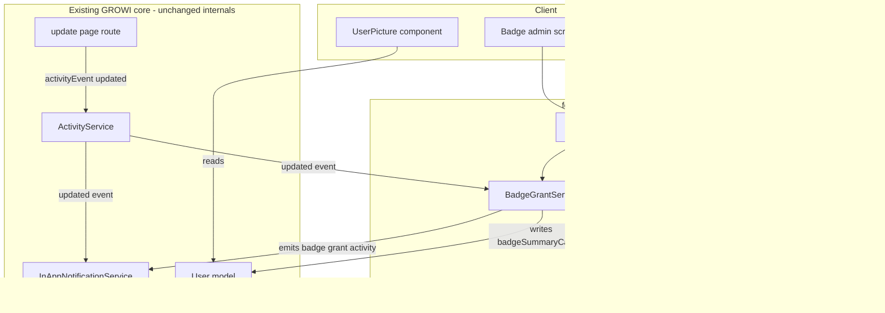
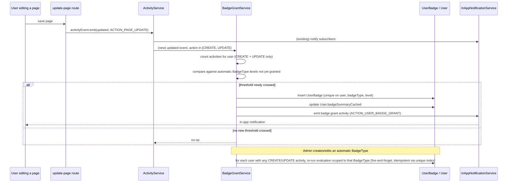
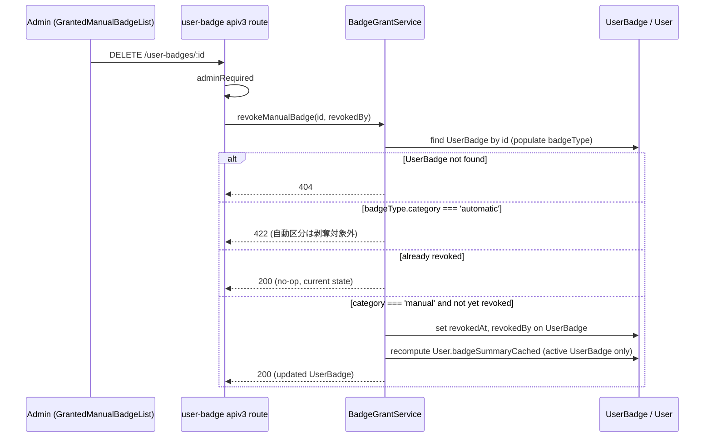

# Technical Design: user-badges

## Overview

**Purpose**: 本機能は、GROWI ユーザーの Wiki 貢献を可視化する「バッジ」を提供する。ページ作成・更新の実績に応じて段階的に自動付与されるバッジと、定量化しにくい貢献に対して管理者が手動で付与するバッジの2系統を、共通のデータモデルと表示基盤の上に構築する。

**Users**: 一般ユーザーはバッジを獲得し、他ユーザーのバッジをコメント・更新履歴・ユーザーページなどで閲覧する。管理者はバッジ種類の管理と手動付与を管理画面から行う。

**Impact**: 既存の `User` ドキュメントに表示用キャッシュフィールドを1つ追加し、既存の `crowi.events.activity`(`'updated'`)イベントに新しい独立リスナーを追加する。既存の Contribution/InAppNotification の集計・通知ロジック自体は変更しない。

### Goals
- 管理者がコード変更なしにバッジ種類(名前・アイコン・説明・自動/手動区分・自動区分のしきい値/レベル)を作成・編集・削除できる
- ページ作成・更新の累積実績としきい値に基づき、段階的なバッジをリアルタイムかつ遡及的に自動付与する
- 管理者が「手動」区分のバッジを任意のユーザーへ理由メモ付きで付与できる
- バッジをユーザー名/アバターが表示される既存箇所全般とユーザーページに、既存 UI への追加フェッチを増やさずに表示する
- バッジ付与時に既存のアプリ内通知経路でユーザーへ通知する

### Non-Goals
- 「自動」区分バッジの取り消し(剥奪)。手動区分の剥奪は本 spec の対象(要件7)
- ページ作成・更新以外の活動(コメント投稿等)を自動付与の対象に含めること
- 「自動」区分バッジ種類の手動付与
- バッジ保有数によるランキング/リーダーボード
- バッジアイコンの任意画像アップロード(許可された Material Symbols アイコン名 / 絵文字のみ)

## Boundary Commitments

### This Spec Owns
- `BadgeType` / `UserBadge` Mongoose コレクションと、それらに対する CRUD・評価・付与ロジック全体
- `User` ドキュメントの新規フィールド `badgeSummaryCached` の書き込み(本 spec のみがこのフィールドの書き込み者)
- 新規 apiv3 エンドポイント(`/badge-types/*`, `/user-badges/*`)とその管理者限定の認可
- バッジ付与に伴う新規 `SupportedAction`/`SupportedTargetModel` エントリと、対応する InAppNotification スナップショット生成ロジック
- `UserPicture` への `badges` 表示オプションの追加、ユーザーページのバッジ一覧セクション、管理画面のバッジ管理 UI
- `BadgeType` のアイコンとして画像ファイルをアップロードする経路(`AttachmentType` への `BADGE_ICON` 値の追加を含む)、および画像アイコンの表示解決ロジック
- 手動区分 `UserBadge` の剥奪(論理削除)とその監査用記録(`revokedAt`/`revokedBy`)、および管理画面での剥奪操作 UI

### Out of Boundary
- 「自動」区分バッジの取り消し(剥奪) — 自動区分は常にシステムが基準に基づいて付与するため対象外(将来の拡張として据え置き)
- Contribution グラフ機能自体の集計範囲・挙動 — 変更しない(本 spec は独立したカウントを持つ)
- `ActivityService`/`InAppNotificationService` の既存リスナー・抑制ロジック(`shouldGenerateUpdate` 等)の変更 — 継承するのみで変更しない
- `UserPicture` の既存 props・レンダリングロジック — 新規 optional prop の追加のみ
- `User` ドキュメントの `badgeSummaryCached` 以外のフィールド・振る舞い

### Allowed Dependencies
- `crowi.events.activity`(`'updated'`)イベント購読(読み取り専用の購読者として追加)
- 既存の `activities`(Prisma)コレクションへの読み取りクエリ
- 既存の InAppNotification パイプライン(`SupportedAction`/`EssentialActionGroup`/スナップショット生成の拡張)
- 既存の admin 認可ミドルウェア(`loginRequiredFactory`, `adminRequiredFactory`, `apiV3FormValidator`, `generateAddActivityMiddleware`)
- 既存の `UserPicture` コンポーネント(拡張、置き換えではない)
- 既存の添付ファイル基盤(`AttachmentService.createAttachment`, `fileUploadService`, `validateImageContentType`, `createContentHeaders`/`/attachment/:id` 配信経路)を読み取り専用の呼び出し元として利用する。基盤自体のロジック(ストレージ抽象化・MIME 検証・SVG の `Content-Disposition: attachment` 強制・CSP 付与)は変更しない

### Revalidation Triggers
- `crowi.events.activity` の `'updated'` イベントのペイロード形状、または `shouldGenerateUpdate` の抑制条件が変わった場合
- `User` ドキュメントのクライアント向けシリアライズ経路が変わった場合(`badgeSummaryCached` の伝播に影響)
- `UserPicture` の `Props` 型、または既存呼び出し元が渡す `user` の形状が変わった場合
- `EssentialActionGroup` またはスナップショット生成の仕組みが変わった場合

## Architecture

### Existing Architecture Analysis

- `ActivityService`(`apps/app/src/server/service/activity.ts`)は `crowi.events.activity` の `'updated'` イベントを、Contribution 集計(`addContribution`)と InAppNotification 生成の共通ファンアウト起点として使っている。本機能はこの既存ファンアウト起点に**新しい独立したリスナー**を追加する形で相乗りし、`ActivityService` 自体のコードは変更しない。
- `InAppNotificationService` は `SupportedAction` が `EssentialActionGroup` に含まれるアクションのみを通知対象とする。新しいアクション(`ACTION_USER_BADGE_GRANT`)をこのグループに追加することで、既存の通知生成パイプラインをそのまま使う。
- `User` ドキュメントには既に `imageUrlCached` という「表示用に非正規化してキャッシュしたフィールド」の前例がある。本機能はこの前例と同じパターンで `badgeSummaryCached` を追加する。

### Architecture Pattern & Boundary Map

**Selected pattern**: 既存のドメイン機能(`apps/app/src/features/contribution-graph/`, `apps/app/src/features/news/`)と同じ「`features/<name>/{interfaces,server,client}` 縦割り機能ディレクトリ」パターン。新規ロジックは `apps/app/src/features/user-badge/` に閉じ込め、既存コアファイルへの変更は最小限(User モデルへのフィールド追加、AdminNavigation・crowi 起動処理への数行の配線)に留める。



**Architecture Integration**:
- Domain/feature boundaries: バッジ固有のドメインロジック・データは `features/user-badge/` に閉じ、既存コアは「イベント購読者が1つ増える」「User に1フィールド増える」「管理メニューに1項目増える」という3点の浅い接続のみを受け入れる
- Existing patterns preserved: apiv3 + admin React CRUD パターン(UserGroup 管理を踏襲)、`getOrCreateModel` による Mongoose モデル定義、`CronService` は本機能では不使用(下記参照)
- New components rationale: `BadgeGrantService` は自動/手動どちらの付与経路も一本化する単一の書き込み窓口とし、`UserBadge` への二重付与を型レベル・DB制約レベルの双方で防ぐ
- Steering compliance: server/client 境界(`src/server` はクライアントから import しない)、i18n 5言語対応、apiv3 レスポンス規約を維持

### Technology Stack

| Layer | Choice / Version | Role in Feature | Notes |
|-------|------------------|-----------------|-------|
| Backend / Data | Mongoose(`getOrCreateModel`) | `BadgeType`, `UserBadge` コレクション定義 | 新規モデルは既存規約どおり素の Mongoose。Prisma への移行は将来の別作業 |
| Backend / Query | Prisma(`activities` コレクション読み取り) | 累積編集回数の直接カウント | 既存の `activities` Prisma スキーマを読み取り専用で利用 |
| Backend / API | Express + apiv3 + express-validator | バッジ種類 CRUD、手動付与、バッジ一覧取得 | 既存 `routerForAdmin`/`router` パターンを踏襲 |
| Messaging / Events | Node `EventEmitter`(`crowi.events.activity`) | 自動付与のリアルタイムトリガー | 新規リスナーとして追加購読、既存発火元は変更しない |
| Frontend | React + SWR + Jotai | 管理画面 CRUD、バッジ表示 | 既存 `apiv3Get/Post/Put/Delete` クライアントユーティリティを踏襲 |
| Shared UI | `packages/ui`(`UserPicture`) | アバター併記のバッジ表示 | 新規 optional prop のみ追加、既存 props は不変 |

## File Structure Plan

### Directory Structure
```
apps/app/src/features/user-badge/
├── interfaces/
│   └── badge.ts                     # IBadgeType, IUserBadge, IUserBadgeSummaryEntry 等の型定義
├── server/
│   ├── models/
│   │   ├── badge-type-model.ts      # BadgeType Mongoose モデル
│   │   └── user-badge-model.ts      # UserBadge Mongoose モデル(一意複合インデックス)
│   ├── services/
│   │   ├── badge-type-service.ts    # バッジ種類の CRUD、ソフトデリート
│   │   └── badge-grant-service.ts   # 自動評価/手動付与/イベント購読/User キャッシュ更新の単一窓口
│   └── routes/
│       ├── badge-type.ts            # /badge-types 系 apiv3 ルート(admin 限定)
│       └── user-badge.ts            # /user-badges 系 apiv3 ルート(手動付与は admin 限定、一覧取得はログインユーザー全般)
└── client/
    ├── stores/
    │   ├── badge-type.ts            # useSWRxBadgeTypeList 等(admin 管理画面用)
    │   └── user-badge.ts            # useSWRxUserBadges(userId)(プロフィール表示用)
    └── components/
        ├── Admin/
        │   ├── BadgeManagement.tsx      # 一覧+作成/編集/削除の親コンポーネント(UserGroupPage.tsx 相当)
        │   ├── BadgeTypeTable.tsx
        │   ├── BadgeTypeModal.tsx
        │   ├── BadgeTypeForm.tsx
        │   ├── BadgeTypeDeleteModal.tsx
        │   ├── ManualGrantModal.tsx     # 手動付与用ユーザー検索+付与フォーム、剥奪一覧を内包する親
        │   └── GrantedManualBadgeList.tsx # 選択中ユーザーの手動付与済みバッジ一覧+剥奪ボタン(ManualGrantModal 内で使用)
        └── BadgeShelf.tsx               # ユーザーページのバッジ一覧セクション
```

### Modified Files
- `apps/app/src/server/models/user/index.js` — スキーマに `badgeSummaryCached: [{ badgeType, iconKey, name, level }]`(default `[]`)を追加。書き込みは `BadgeGrantService` のみが行う
- `apps/app/src/interfaces/activity.ts` — `ACTION_USER_BADGE_GRANT`, `ACTION_ADMIN_BADGE_TYPE_CREATE/UPDATE/DELETE` を追加し、`ACTION_USER_BADGE_GRANT` を `EssentialActionGroup` に追加。`SupportedTargetModel` に `MODEL_USER_BADGE` を追加
- `apps/app/src/server/service/in-app-notification/in-app-notification-utils.ts` — `generateSnapshot` に `UserBadge` 向け分岐を追加
- `apps/app/src/models/serializers/in-app-notification-snapshot/` — `user-badge.ts` を新規追加(既存 `page.ts` と同パターン)
- `apps/app/src/server/routes/apiv3/index.js` — `routerForAdmin.use('/badge-types', ...)`、`router.use('/user-badges', ...)` を配線
- `apps/app/src/server/crowi/index.ts` — 起動処理内で `BadgeGrantService` をインスタンス化(コンストラクタ内でイベント購読を開始)
- `packages/ui/src/components/UserPicture.tsx` — 新規 optional prop `badges?: UserPictureBadge[]` を追加。既存 props・レンダリング・呼び出し元は変更なし
- `apps/app/src/client/components/UsersHomepageFooter.tsx` / `UsersHomepageFooter.consts.tsx` — `BadgeShelf` セクションを ContributionGraph セクションの直後に追加
- `apps/app/src/components/Admin/Common/AdminNavigation.tsx` — `MenuLabel` に `'badges'` ケース、`section_users` ブロックに `MenuLink menu="badges"` を追加(モバイルドロップダウン側にも対応行を追加)
- `apps/app/src/pages/admin/badges.page.tsx` — 新規 admin ページルート(`getServerSideAdminCommonProps` + `dynamic(..., { ssr: false })` で `BadgeManagement` を読み込み)
- `apps/app/public/static/locales/{en_US,ja_JP,ko_KR,fr_FR,zh_CN}/admin.json` / `commons.json` — バッジ管理・バッジ表示関連キーを追加
- `apps/app/src/server/interfaces/attachment.ts` — `AttachmentType` に `BADGE_ICON` を追加(既存の `PROFILE_IMAGE`/`BRAND_LOGO` と同列)
- `apps/app/src/features/user-badge/server/models/badge-type-model.ts` — `iconType`/`iconAttachment` フィールドと条件付き必須のスキーマ検証を追加
- `apps/app/src/features/user-badge/server/services/badge-type-service.ts` — `updateBadgeType`/`createBadgeType` に画像アイコンの保存・置換(既存 `AttachmentService.createAttachment` 呼び出し、対象 `BadgeType` 自身の旧 `iconAttachment` ID が指す `Attachment` のみを削除)ロジックを追加。**注意**: `apiv3/customize-setting.js` の `upload-brand-logo` ルートは `attachmentType: BRAND_LOGO` で検索して該当する添付ファイルを一括削除するが、これはブランドロゴがサイト全体で1枚のみという前提に基づく実装であり、バッジ種類は複数存在し種類ごとに個別の画像を持つため、その削除パターンをそのまま流用してはならない。削除対象は必ず「更新対象の `BadgeType` ドキューメントが編集前に保持していた `iconAttachment` ID」に限定し、`attachmentType` だけでの絞り込み削除は行わない
- `apps/app/src/features/user-badge/server/routes/badge-type.ts` — アイコン画像アップロード用の multipart ハンドリングを追加(`apiv3/customize-setting.js` の `upload-brand-logo` ルートと同パターン)
- `apps/app/src/features/user-badge/client/components/Admin/BadgeTypeForm.tsx` — アイコン指定方法の切り替え UI(Material Symbols / 絵文字 / 画像アップロード)を追加。「画像アップロード」の選択肢は `category === 'manual'` のときのみ表示し、`category === 'automatic'` では非表示にする(既存の Material Symbols / 絵文字トグルのみ表示)
- `apps/app/src/features/user-badge/client/components/Admin/BadgeTypeTable.tsx` — `{badgeType.iconKey}` の素朴なテキスト描画(`BadgeTypeTable.tsx:60`)に `iconType === 'image'` 判定を追加し、画像の場合は `` サムネイルを描画する分岐を追加
- `packages/ui/src/components/UserPicture.tsx` — `UserPictureBadge` 型に `iconType`/`iconUrl` を追加し、既存の `isEmojiIconKey` による絵文字/Material-Symbols判定(`UserPicture.tsx:171,258-264`)に先立って `iconType === 'image'` を判定し `` で描画する分岐を追加。3種類の判定順は「`iconType === 'image'` → `` / それ以外 → 従来通り `isEmojiIconKey` 判定」とする
- `apps/app/src/features/user-badge/client/components/BadgeShelf.tsx` — `resolveEntryDisplay`(`BadgeShelf.tsx:50-62`)が解決した `iconKey` を最終描画する箇所(`BadgeShelf.tsx:108-112`)に、`UserPicture.tsx` と同じ `iconType === 'image'` 判定を追加。`category: 'manual'` の場合 `levelDef` が存在しないため既存の `?? badgeType.iconKey` フォールバックがそのまま `badgeType` の `iconType`/`iconAttachment` を素通しする(解決ロジック自体の変更は不要、最終描画の分岐追加のみ)
- `apps/app/src/features/user-badge/server/services/badge-grant-service.ts` — `updateBadgeSummaryCached`(`badge-grant-service.ts:141-169`)が `IUserBadgeSummaryEntry` を構築する際、`iconType`/`iconUrl`(`Attachment.filePathProxied` を解決した値)を含めるよう拡張する。加えて `revokeManualBadge` メソッドを追加(要件7)
- `apps/app/src/features/user-badge/server/models/user-badge-model.ts` — `revokedAt: Date | null`, `revokedBy: Types.ObjectId | null` フィールドを追加し、一意複合インデックス `{ user, badgeType, level }` を `partialFilterExpression: { revokedAt: null }` 付きの部分インデックスに変更する(要件7)
- `apps/app/src/features/user-badge/server/routes/user-badge.ts` — `DELETE /user-badges/:id`(剥奪、admin 限定)を追加。`GET /user-badges` に admin 限定の `includeRevoked` クエリパラメータを追加する(要件7)
- `apps/app/src/features/user-badge/client/stores/user-badge.ts` — `useSWRxRevokeUserBadge` 相当のミューテーション、および `includeRevoked` を渡せるよう `useSWRxUserBadges` を拡張する(要件7)
- `apps/app/src/features/user-badge/client/components/Admin/ManualGrantModal.tsx` — 対象ユーザー選択後、既存の付与フォームに加えて `GrantedManualBadgeList` を表示する(要件7)
- `apps/app/public/static/locales/{en_US,ja_JP,ko_KR,fr_FR,zh_CN}/admin.json` — 剥奪操作・確認ダイアログ・剥奪済み表示に関する i18n キーを追加(要件7)

## System Flows

### 自動付与(リアルタイム)としきい値変更時の遡及付与(resweep)



- しきい値の判定と付与は同一トランザクション相当の1関数(`evaluateAndGrantForUser`)内で行い、リアルタイム経路・resweep 経路の両方から呼び出す(ロジックの重複を避ける)
- resweep は apiv3 のバッジ種類作成/更新レスポンスをブロックしない fire-and-forget 呼び出しとして実行する(`update-page.ts` の `postAction(...)` と同じ非同期発火パターン)
- `(user, badgeType, level)` の一意複合インデックスにより、リアルタイム経路と resweep 経路が同時に同じ付与を試みても重複は発生しない

### 手動バッジの剥奪



- `revokeManualBadge` は `grantManualBadge` と同じ「UserBadge 更新 → `badgeSummaryCached` 再計算」の一貫パターンに従う(通知は発火しない。剥奪の通知は要件外)
- `GrantedManualBadgeList` は剥奪成功後、`useSWRxUserBadges` の `mutate` で再検証し、一覧上の該当行を「剥奪済み」表示に更新する

## Requirements Traceability

| Requirement | Summary | Components | Interfaces | Flows |
|-------------|---------|------------|------------|-------|
| 1.1 | バッジ種類の新規作成 | BadgeTypeService, badge-type route | `BadgeTypeService.createBadgeType` | - |
| 1.2 | 自動区分はレベル毎のしきい値必須 | BadgeType model(スキーマ検証) | `IBadgeType.levels` | - |
| 1.3 | 手動区分はしきい値不要 | BadgeType model(スキーマ検証) | `IBadgeType.levels` (空配列) | - |
| 1.4 | 編集は将来評価にのみ反映、既存付与は不変 | BadgeTypeService | `BadgeTypeService.updateBadgeType` | - |
| 1.5 | 削除はソフトデリート、既存付与は表示継続 | BadgeTypeService, BadgeType model | `BadgeTypeService.deleteBadgeType` | - |
| 1.6 | 管理者以外は操作拒否 | badge-type route(adminRequired) | - | - |
| 2.1 | ページ作成/更新のみを貢献実績としてカウント | BadgeGrantService | `getCumulativeEditCount` | 自動付与フロー |
| 2.2 | しきい値到達で自動付与 | BadgeGrantService | `evaluateAndGrantForUser` | 自動付与フロー |
| 2.3 | 上位レベル付与、下位レベルは保持 | BadgeGrantService, UserBadge model | `evaluateAndGrantForUser` | 自動付与フロー |
| 2.4 | 同一バッジ・同一レベルの重複付与禁止 | UserBadge model(一意複合インデックス) | - | 自動付与フロー |
| 2.5 | 既存貢献実績の遡及付与 | BadgeGrantService | `evaluateAndGrantForUser`(resweep) | 自動付与フロー(resweep) |
| 2.6 | コメント等は自動付与対象に含めない | BadgeGrantService | `getCumulativeEditCount`(action フィルタ) | 自動付与フロー |
| 3.1 | 手動付与時に付与者・日時を記録 | BadgeGrantService, user-badge route | `BadgeGrantService.grantManualBadge` | - |
| 3.2 | 付与理由メモの保存 | UserBadge model | `IUserBadge.note` | - |
| 3.3 | 管理者以外は操作拒否 | user-badge route(adminRequired) | - | - |
| 3.4 | 自動区分の手動付与は拒否 | BadgeGrantService | `grantManualBadge`(category 検証) | - |
| 3.5 | 同一手動バッジを複数ユーザーへ独立付与 | UserBadge model | `IUserBadge`(user 単位のドキュメント) | - |
| 4.1 | ユーザー名/アバター併記箇所へのバッジ表示 | UserPicture | `UserPictureBadge`, `User.badgeSummaryCached` | - |
| 4.2 | バッジ0件時はプレースホルダーなし | UserPicture | `UserPictureBadge[]`(空配列時非表示) | - |
| 4.3 | ユーザーページでの全バッジ一覧 | BadgeShelf, user-badge route | `useSWRxUserBadges` | - |
| 4.4 | 同系統は最高レベルのみ併記、全レベルはページ側 | BadgeGrantService(cached 生成ロジック), BadgeShelf | `User.badgeSummaryCached` vs `useSWRxUserBadges` | - |
| 4.5 | ホバー/フォーカスで名前・説明を表示 | UserPicture, badge-type client store | `useSWRxBadgeTypeList`(ローカルカタログ参照) | - |
| 5.1 | 付与時にアプリ内通知 | BadgeGrantService, InAppNotificationService(既存) | `ACTION_USER_BADGE_GRANT` | 自動付与フロー / 手動付与 |
| 6.1 | 手動区分にアイコン指定方法として画像アップロードを追加 | BadgeTypeForm(admin UI), BadgeType model | `IBadgeType.iconType` | - |
| 6.1a | 自動区分では画像アップロードを選択肢として提供しない | BadgeTypeForm(admin UI), BadgeType model(スキーマ検証) | `IBadgeType.iconType`(`category==='automatic'` で `'image'` 拒否) | - |
| 6.2 | 既存添付ファイル基盤での保存(サイズ・MIME 検証) | badge-type apiv3 route, AttachmentService(既存) | `AttachmentService.createAttachment`(`AttachmentType.BADGE_ICON`) | 画像アイコンアップロードフロー |
| 6.3 | 非画像 MIME のアップロード拒否 | AttachmentService(既存), `validateImageContentType`(既存) | - | 画像アイコンアップロードフロー |
| 6.4 | 再アップロード時に旧ファイルを置き換え(同一 BadgeType 内に限定、他のバッジ種類の画像には影響しない) | badge-type apiv3 route | `BadgeTypeService.updateBadgeType`(対象 BadgeType 自身の旧 `iconAttachment` ID のみ削除) | 画像アイコンアップロードフロー |
| 6.5 | 画像アイコンの表示 | UserPicture(拡張), UserPictureBadge | `IUserBadgeSummaryEntry.iconType`/`iconUrl` | - |
| 7.1 | 手動区分バッジの剥奪操作 | BadgeGrantService, user-badge route, GrantedManualBadgeList | `BadgeGrantService.revokeManualBadge` | 剥奪フロー |
| 7.2 | 剥奪後は表示対象から除外 | BadgeGrantService(cached 再計算), UserPicture, BadgeShelf | `updateBadgeSummaryCached`(`revokedAt: null` のみ集計) | 剥奪フロー |
| 7.3 | 剥奪者・剥奪日時の記録 | UserBadge model | `IUserBadge.revokedAt`/`revokedBy` | 剥奪フロー |
| 7.4 | 管理者以外は操作拒否 | user-badge route(adminRequired) | - | - |
| 7.5 | 自動区分の剥奪は拒否 | BadgeGrantService | `revokeManualBadge`(category 検証) | 剥奪フロー |
| 7.6 | 剥奪記録は物理削除しない | UserBadge model | `IUserBadge.revokedAt`(論理削除フラグ) | - |
| 7.7 | 管理者は剥奪状態を判別できる形で履歴を閲覧できる | user-badge route, GrantedManualBadgeList | `GET /user-badges?includeRevoked=true` | - |

## Components and Interfaces

| Component | Domain/Layer | Intent | Req Coverage | Key Dependencies (P0/P1) | Contracts |
|-----------|--------------|--------|---------------|---------------------------|-----------|
| BadgeType model | Data | バッジ種類の永続化(`iconType`/`iconAttachment` を含む) | 1.1-1.6, 6.1-6.4 | getOrCreateModel (P0) | State |
| UserBadge model | Data | 付与記録の永続化・重複防止 | 2.4, 3.1-3.5 | getOrCreateModel (P0) | State |
| BadgeTypeService | Server logic | バッジ種類 CRUD・ソフトデリート・アイコン画像の保存/置換 | 1.1-1.6, 6.1-6.4 | BadgeType model (P0), AttachmentService(既存) (P0) | Service |
| BadgeGrantService | Server logic | 自動評価・手動付与・手動剥奪・通知発火・User キャッシュ更新の単一窓口 | 2.1-2.6, 3.1-3.5, 4.4, 5.1, 7.1-7.3, 7.5, 7.6 | UserBadge/BadgeType model (P0), crowi.events.activity (P0), User model (P0), InAppNotificationService (P1) | Service, Event |
| badge-type apiv3 route | API | バッジ種類 CRUD の HTTP 境界 | 1.1-1.6 | BadgeTypeService (P0) | API |
| user-badge apiv3 route | API | 手動付与・剥奪・一覧取得の HTTP 境界 | 3.1-3.5, 4.3, 7.1, 7.4, 7.5, 7.7 | BadgeGrantService (P0) | API |
| UserPicture(拡張) | UI(共有) | アバター併記のバッジ表示(画像アイコンの表示を含む) | 4.1, 4.2, 4.5, 6.5 | User.badgeSummaryCached (P0) | - |
| BadgeShelf | UI | ユーザーページの全バッジ一覧 | 4.3, 4.4 | user-badge route (P0) | - |
| Badge admin screens | UI(admin) | バッジ種類 CRUD・手動付与フォーム | 1.1-1.6, 3.1-3.5 | badge-type/user-badge route (P0) | - |

### Server / Data

#### BadgeType model

| Field | Detail |
|-------|--------|
| Intent | バッジ種類(自動区分は複数レベルを内包する系列、手動区分は単一バッジ)の永続化 |
| Requirements | 1.1, 1.2, 1.3, 1.5 |

**Responsibilities & Constraints**
- 自動区分(`category: 'automatic'`)は `levels`(1件以上、`level` 昇順・重複禁止、各要素に `threshold` 必須)を保持する
- 手動区分(`category: 'manual'`)は `levels` を空配列とし、`threshold` の入力自体を受け付けない
- 削除は `isDeleted`/`deletedAt` によるソフトデリートのみ。物理削除は行わない(`UserBadge.badgeType` 参照の整合性を保つため)

**Dependencies**
- Inbound: BadgeTypeService — CRUD 操作の唯一の書き込み元 (P0)
- Outbound: なし

**Contracts**: State [x]

##### State Management
- State model: `category` によって `levels` の有無が決まる判別可能なドキュメント形状(アプリ層でスキーマバリデーションを行う)
- Persistence & consistency: MongoDB 単一ドキュメント、`level` の一意性はアプリ層 + スキーマの `validate` で保証
- Concurrency strategy: 楽観的排他は不要(バッジ種類の編集は低頻度の管理操作)

```typescript
export type BadgeCategory = 'automatic' | 'manual';

export interface IBadgeLevel {
  level: number;        // 1 から始まる連番、BadgeType 内で一意
  name: string;
  iconKey: string;      // Material Symbols アイコン名、または単一絵文字
  threshold: number;    // 累積編集回数のしきい値(1以上)
}

export type BadgeIconType = 'materialSymbol' | 'emoji' | 'image';

export interface IBadgeType {
  name: string;
  description: string;
  iconType: BadgeIconType; // 'image' のとき iconKey は無視され iconAttachment を参照する
  iconKey: string;      // manual: バッジ本体のアイコン / automatic: 系列の既定アイコン(iconType が 'image' の場合は未使用)
  iconAttachment: Types.ObjectId | null; // ref Attachment、iconType === 'image' のときのみ設定
  category: BadgeCategory;
  levels: IBadgeLevel[]; // category: 'manual' の場合は常に []
  isDeleted: boolean;
  deletedAt: Date | null;
  createdBy: Types.ObjectId; // ref User
}
```

**Icon の粒度・区分に関する決定**: 画像アイコンは `category: 'manual'` のバッジ種類にのみ許可する(`category: 'automatic'` では `iconType: 'image'` を選択できず、常に `materialSymbol`/`emoji` のみとする)。理由は2つ:
1. 自動区分は `IBadgeLevel.iconKey` によってレベル毎に個別のアイコン(例: 🥉→🥈→🥇)を持てる既存の仕様があるが、`IBadgeLevel` には `iconType`/`iconAttachment` を追加しない(レベル毎に別画像をアップロードさせる UI/検証コストを避けるため)。画像アイコンをレベル毎の概念がない `manual` 区分に限定することで、この非対称性(自動区分でレベルが上がっても画像が変わらない、というエミュートとの機能差)自体を発生させない
2. `manual` 区分は `levels` を持たない単一バッジなので、`BadgeShelf`/`badge-grant-service` の既存フォールバック(`levelDef?.iconKey ?? badgeType.iconKey`)は `levelDef` が存在しないため常に `badgeType.iconKey`(= `iconType`/`iconAttachment` 込みの型レベル情報)を参照する。つまり **これらの参照解決ロジック自体には変更が不要**で、各表示箇所の最終レンダリング分岐(後述)に `iconType === 'image'` の3番目の枝を追加するだけで済む

`BadgeType` スキーマは `category === 'automatic'` のとき `iconType !== 'image'` をバリデーションで強制する(`pre('validate')` に追加)。

**Implementation Notes**
- Integration: `getOrCreateModel<IBadgeTypeDocument, IBadgeTypeModel>('BadgeType', schema)` パターンに従う
- Validation: `category === 'automatic'` のとき `levels.length >= 1` かつ `threshold` 必須、`category === 'manual'` のとき `levels.length === 0` をスキーマの `pre('validate')` で強制
- Validation: `iconType === 'image'` のとき `iconAttachment` が必須、それ以外(`materialSymbol`/`emoji`)のとき `iconAttachment` は `null` を強制する
- Validation: `category === 'automatic'` のとき `iconType === 'image'` を拒否する(自動区分は `materialSymbol`/`emoji` のみ許可)
- Risks: `iconAttachment` が参照する `Attachment` ドキュメントが何らかの理由で削除された場合、表示側は画像が解決できない(欠損アイコン)。本 spec では `Attachment` の物理削除経路(BadgeTypeService 経由の再アップロード置換のみ)を自ら管理するため、通常運用では発生しない

#### UserBadge model

| Field | Detail |
|-------|--------|
| Intent | 誰にどのバッジ(レベル)がいつ・誰によって付与されたか、および(手動区分のみ)剥奪されたかの記録 |
| Requirements | 2.3, 2.4, 3.1, 3.2, 3.5, 7.1, 7.3, 7.6 |

**Responsibilities & Constraints**
- `(user, badgeType, level)` に**部分**一意複合インデックス(`revokedAt: null` の記録のみを対象)を持ち、同一バッジ(同一レベル)の重複「有効」付与を DB 制約レベルで防止する(`level: null` の手動バッジにも同様に適用される)。剥奪済みレコードはこのインデックスの対象外となるため、剥奪後に同一バッジを再付与すると新しい `UserBadge` ドキュメントが作成される(剥奪前の記録は監査目的でそのまま残る)
- 付与済みフィールド(`grantedAt`/`grantedBy`/`note` 等)は不変。唯一許される更新は手動区分バッジの剥奪(`revokedAt`/`revokedBy` の設定)のみで、物理削除・その他フィールドの更新は行わない

**Dependencies**
- Inbound: BadgeGrantService — 唯一の書き込み元 (P0)
- Outbound: BadgeType(参照), User(参照)

**Contracts**: State [x]

##### State Management
```typescript
export interface IUserBadge {
  user: Types.ObjectId;        // ref User
  badgeType: Types.ObjectId;   // ref BadgeType
  level: number | null;        // 自動区分: 付与されたレベル番号 / 手動区分: null
  grantedAt: Date;
  grantedBy: Types.ObjectId | null; // null = システムによる自動付与
  note: string | null;         // 手動付与時の任意メモ
  revokedAt: Date | null;      // null = 有効。手動区分のみ非 null になりうる
  revokedBy: Types.ObjectId | null; // ref User(剥奪操作を行った管理者)。revokedAt が null の場合は常に null
}
```
- Persistence & consistency: `{ user: 1, badgeType: 1, level: 1 }` 部分一意複合インデックス(`partialFilterExpression: { revokedAt: null }`)
- Concurrency strategy: 挿入時の重複キーエラー(`E11000`)は「既に付与済み」として無視する冪等な書き込み。剥奪の再実行(既に `revokedAt` が設定済みの記録への再剥奪)は冪等な no-op として扱い、現在の状態をそのまま返す

### Server / Logic

#### BadgeTypeService

| Field | Detail |
|-------|--------|
| Intent | バッジ種類の CRUD とソフトデリートを提供する |
| Requirements | 1.1, 1.2, 1.3, 1.4, 1.5 |

**Responsibilities & Constraints**
- 作成・編集時に自動/手動区分に応じたバリデーションを適用する
- 自動区分のバッジ種類が新規作成または `levels`/`threshold` が変更された場合、`BadgeGrantService` の resweep を fire-and-forget で呼び出す

**Dependencies**
- Inbound: badge-type apiv3 route (P0)
- Outbound: BadgeType model (P0), BadgeGrantService(resweep 呼び出し) (P1)

**Contracts**: Service [x]

##### Service Interface
```typescript
interface BadgeTypeService {
  createBadgeType(input: CreateBadgeTypeInput, createdBy: IUserHasId): Promise<IBadgeTypeHasId>;
  updateBadgeType(id: string, input: UpdateBadgeTypeInput): Promise<IBadgeTypeHasId>;
  deleteBadgeType(id: string): Promise<void>; // ソフトデリート
  listBadgeTypes(includeDeleted: boolean): Promise<IBadgeTypeHasId[]>;
}
```
- Preconditions: `input.category` に応じた `levels`/`threshold` の整合性(スキーマ検証に委譲)
- Postconditions: 作成/編集された `BadgeType` が永続化される。自動区分の作成/しきい値変更時は resweep が非同期に開始される
- Invariants: ソフトデリートされた `BadgeType` は `listBadgeTypes(false)` の結果から除外されるが、`UserBadge` からの参照解決には引き続き使える

**Implementation Notes**
- Integration: apiv3 route から呼ばれる。resweep の呼び出しは `await` せず fire-and-forget とし、apiv3 レスポンスをブロックしない
- Validation: express-validator によるリクエスト形式検証 + サービス層でのカテゴリ整合性検証の二段構え
- Risks: resweep 中にプロセスが再起動した場合、resweep は完了しないが冪等なため次回のいずれかのトリガー(実時間評価または次の resweep)で解消される

#### BadgeGrantService

| Field | Detail |
|-------|--------|
| Intent | 自動評価・手動付与・手動バッジ剥奪・User 表示キャッシュ更新・通知発火を一本化する単一の付与/剥奪窓口 |
| Requirements | 2.1, 2.2, 2.3, 2.4, 2.5, 2.6, 3.1, 3.2, 3.4, 3.5, 4.4, 5.1, 7.1, 7.2, 7.3, 7.5, 7.6 |

**Responsibilities & Constraints**
- コンストラクタで `crowi.events.activity.on('updated', ...)` を購読し、`action` が `ACTION_PAGE_CREATE`/`ACTION_PAGE_UPDATE` の場合のみ処理する(`ActivityService` 自体は変更しない)
- 自動付与・手動付与ともに最終的に同じ「UserBadge 作成 → `User.badgeSummaryCached` 更新 → 通知用 Activity 発火」という3ステップを通る単一内部関数に集約する
- 手動付与時、対象 `BadgeType.category` が `'automatic'` の場合は拒否する(要件 3.4)
- 剥奪(`revokeManualBadge`)時、対象 `UserBadge` が参照する `BadgeType.category` が `'automatic'` の場合は拒否する(要件 7.5)。剥奪は「`revokedAt`/`revokedBy` の設定 → 対象ユーザーの `User.badgeSummaryCached` 再計算(`revokedAt: null` の `UserBadge` のみを対象に集計)」の2ステップを一貫して行う

**Dependencies**
- Inbound: `crowi.events.activity`(自動評価トリガー) (P0), user-badge apiv3 route(手動付与・剥奪) (P0), BadgeTypeService(resweep 呼び出し元) (P1)
- Outbound: UserBadge/BadgeType model (P0), User model(`badgeSummaryCached` 書き込み) (P0), `activities`(Prisma、累積カウント読み取り) (P0), InAppNotificationService(既存パイプライン経由) (P1)

**Contracts**: Service [x] / Event [x]

##### Service Interface
```typescript
interface BadgeGrantService {
  evaluateAndGrantForUser(userId: string, scopedBadgeTypeId?: string): Promise<IUserBadgeHasId[]>;
  grantManualBadge(
    input: { badgeTypeId: string; userId: string; note?: string },
    grantedBy: IUserHasId,
  ): Promise<IUserBadgeHasId>;
  revokeManualBadge(userBadgeId: string, revokedBy: IUserHasId): Promise<IUserBadgeHasId>;
}
```
- Preconditions: `grantManualBadge` は対象 `BadgeType.category === 'manual'` であること。`revokeManualBadge` は対象 `UserBadge` が存在し、その `BadgeType.category === 'manual'` であること
- Postconditions: 新規に条件を満たしたレベル/バッジのみ `UserBadge` として作成され、既存の付与記録は変更されない。`revokeManualBadge` は対象 `UserBadge` の `revokedAt`/`revokedBy` のみを設定し、他フィールドは変更しない。既に剥奪済みの記録への再呼び出しは現在の状態をそのまま返す(冪等)
- Invariants: 同一 `(user, badgeType, level)` の**有効な**(`revokedAt: null`)記録は常に高々1件しか存在しない(DB の部分一意制約に委譲)。剥奪済みの記録は同インデックスの対象外のため、再付与時に新規ドキュメントとして共存しうる

##### Event Contract
- Subscribed events: `crowi.events.activity`(`'updated'`)— `action` でフィルタし `ACTION_PAGE_CREATE`/`ACTION_PAGE_UPDATE` のみ処理
- Published events: 新規 `UserBadge` 作成後、`activityEvent.emit('update', ...)` で `ACTION_USER_BADGE_GRANT` を発火し、既存 `InAppNotificationService` の通知生成パイプラインに委譲する
- Ordering / delivery guarantees: Node `EventEmitter` の同期配信に準拠。配信失敗時の再送は行わない(既存 Activity/通知パイプラインの信頼性モデルを継承)

**Implementation Notes**
- Integration: 累積編集回数は `getCumulativeEditCount(userId)`(`prisma.activities.count({ where: { userId, action: { in: [ACTION_PAGE_CREATE, ACTION_PAGE_UPDATE] } } })`)で取得する。Contribution モデルは対象アクション範囲が異なるため使用しない(`research.md` 参照)
- Validation: `evaluateAndGrantForUser` はしきい値を跨いだレベルをすべて一度に付与できるようにし(一括インポート等でカウントが飛躍した場合も対応)、下位レベルの記録を削除しない
- Risks: 自動付与経路(イベントリスナー、リクエストコンテキストなし)から Activity レコードを作成する具体的な内部関数は実装時に確定させる(`research.md` の Open Risk 参照)

### API

#### badge-type apiv3 route

| Method | Endpoint | Request | Response | Errors |
|--------|----------|---------|----------|--------|
| GET | `/badge-types` | - | `IBadgeTypeHasId[]` | 401, 403 |
| POST | `/badge-types` | `CreateBadgeTypeInput` | `IBadgeTypeHasId` | 400, 401, 403 |
| PUT | `/badge-types/:id` | `UpdateBadgeTypeInput` | `IBadgeTypeHasId` | 400, 401, 403, 404 |
| DELETE | `/badge-types/:id` | - | `{ isDeleted: true }` | 401, 403, 404 |

- ミドルウェア連鎖: `loginRequiredStrictly, adminRequired, addActivity, validator.*, apiV3FormValidator`(`user-group.js` と同一パターン)
- `addActivity` を経て `ACTION_ADMIN_BADGE_TYPE_CREATE/UPDATE/DELETE` を記録する(監査ログとしては通知対象外、`EssentialActionGroup` には含めない)

#### user-badge apiv3 route

| Method | Endpoint | Request | Response | Errors |
|--------|----------|---------|----------|--------|
| GET | `/user-badges?targetUserId=&includeRevoked=` | - | `IUserBadgeHasId[]`(BadgeType 情報を populate) | 400, 401 |
| POST | `/user-badges` | `{ badgeTypeId, userId, note? }` | `IUserBadgeHasId` | 400, 401, 403, 404, 422(自動区分への手動付与) |
| DELETE | `/user-badges/:id` | - | `IUserBadgeHasId`(剥奪後の状態。既に剥奪済みなら現在の状態をそのまま返す) | 401, 403, 404, 422(自動区分バッジの剥奪) |

- `GET` はログイン済み一般ユーザーが利用可能(自分・他人問わずプロフィール表示のため)。`includeRevoked=true` は `adminRequired` を満たす場合のみ有効で、それ以外のリクエストでは無視され常に有効な記録のみを返す。`POST`(手動付与)・`DELETE`(剥奪)は `adminRequired`

### Client / UI(要約のみ、新規境界を持たないため詳細ブロック省略)

- **UserPicture(拡張)**: 新規 optional prop `badges?: UserPictureBadge[]`(`{ iconKey: string; name: string; level: number | null }[]`、`packages/ui` 内で完結する表示専用型、`apps/app` のドメイン型に依存しない)。`badges` が空/未指定なら既存描画から一切変化しない。ホバー/フォーカス時のツールチップは、クライアント側で一度取得済みのバッジ種類カタログ(`useSWRxBadgeTypeList` 相当を一般ユーザー向けにも提供、または軽量な公開エンドポイント)から名前・説明を解決する
- **BadgeShelf**: `useSWRxUserBadges(userId)` で取得した全付与バッジ(レベル別)をアイコン・名前・付与日とともに一覧表示。`UsersHomepageFooter.tsx` の ContributionGraph セクション直後に配置
- **Badge admin screens**: `UserGroup` 管理画面(`BadgeManagement.tsx` が `UserGroupPage.tsx` 相当、`BadgeTypeTable/Modal/Form/DeleteModal` が対応コンポーネント相当)と同一パターン。追加で `ManualGrantModal.tsx`(ユーザー検索 + 手動バッジ選択 + メモ入力)を持つ
- **GrantedManualBadgeList**: `ManualGrantModal.tsx` 内で対象ユーザー選択後に表示。`useSWRxUserBadges(userId, { includeRevoked: true })` で当該ユーザーの手動バッジ付与記録(有効/剥奪済み双方)を取得し、`category: 'manual'` のもののみ一覧化する。有効な記録には剥奪確認ダイアログ付きの「剥奪」ボタンを、剥奪済みの記録には剥奪日時・実行者を示すバッジ表示を付ける(要件 7.7)

**Implementation Notes**
- Integration: 管理画面は `apps/app/src/stores/badge-type.ts` の `useSWRxBadgeTypeList`/`useSWRxBadgeType`(`useSWRImmutable`)経由、`apiv3Post/Put/Delete` 呼び出し後に `mutate` で再検証(`UserGroupPage.tsx` と同一パターン)
- Validation: フォームは `useState` ベース(react-hook-form は使わない、既存 `UserGroupForm.tsx` の規約に合わせる)
- Risks: なし

## Data Models

### Domain Model
- **Aggregate**: `BadgeType` はレベル(`IBadgeLevel[]`)を内包する集約ルート。レベル単体は `BadgeType` の外部から直接参照・更新されない
- **Aggregate**: `UserBadge` は独立した集約ルート(付与記録)。`BadgeType`/`User` への参照は ID 参照のみ
- **Domain event**: バッジ付与(`UserBadge` 作成)は `ACTION_USER_BADGE_GRANT` という Activity ドメインイベントとして表現される
- **Invariant**: `(user, badgeType, level)` の組は高々1件

### Logical Data Model
- `BadgeType 1 --- N UserBadge`(`badgeType` 参照)、`User 1 --- N UserBadge`(`user` 参照)
- `User 1 --- 1 badgeSummaryCached[]`(非正規化キャッシュ、`UserBadge` の派生データであり正とはしない。正は `UserBadge` コレクション)

### Data Contracts & Integration
- `IUserBadgeSummaryEntry`(`User.badgeSummaryCached` の要素型)は「そのバッジ系列で保有する、剥奪されていない最高レベル」のみを保持する(`revokedAt: null` の `UserBadge` のみを集計対象とする)。系列数に上限は設けない(v1 では管理者が作成するバッジ種類数は小さいと想定。Open Questions 参照)

```typescript
export interface IUserBadgeSummaryEntry {
  badgeType: Types.ObjectId;
  iconType: BadgeIconType;
  iconKey: string;       // iconType === 'image' の場合は空文字(未使用)
  iconUrl: string | null; // iconType === 'image' の場合のみ filePathProxied を解決してキャッシュ、それ以外は null
  name: string;
  level: number | null;
}
```

`iconUrl` は付与/更新時点で `Attachment.filePathProxied` を解決してキャッシュする(表示のたびに `Attachment` を参照しに行かない、既存の `badgeSummaryCached` 非正規化方針に合わせる)。

## Error Handling

### Error Strategy
GROWI の既存 apiv3 規約(`ErrorV3` + `res.apiv3Err`)に従い、型付きの Error サブクラスを投げてルート層で変換する。

### Error Categories and Responses
- **User Errors(4xx)**: 不正な `category`/`levels` 構成 → 400(バリデーションエラー内容を返す)。管理者権限なし → 403。存在しない `BadgeType`/対象ユーザー/`UserBadge` → 404
- **Business Logic Errors(422)**: 自動区分バッジ種類への手動付与試行 → 422 + 「自動区分は自動評価によってのみ付与される」旨のエラーメッセージ(要件 3.4)。自動区分の `UserBadge` を剥奪しようとした場合 → 422 + 「自動区分は剥奪の対象外」旨のエラーメッセージ(要件 7.5)
- **System Errors(5xx)**: `UserBadge` 作成時の予期しない DB エラー(重複キー以外)→ 500、ログ記録。重複キー(`E11000`)は「既に付与済み」として正常系扱いし、エラーを外部に伝播しない。既に剥奪済みの `UserBadge` への再剥奪はエラーとせず、現在の状態を 200 で返す(冪等)

## Testing Strategy

### Unit Tests
- `BadgeType` スキーマ検証: 自動区分で `levels` が空/`threshold` 欠落の場合に検証エラーになること(1.2)、手動区分で `levels` が空でない場合に検証エラーになること(1.3)
- `BadgeGrantService.getCumulativeEditCount`: `ACTION_PAGE_CREATE`/`ACTION_PAGE_UPDATE` のみをカウントし、`ACTION_COMMENT_CREATE` 等を含めないこと(2.6)
- `BadgeGrantService.evaluateAndGrantForUser`: しきい値未到達では付与しないこと、複数レベルを一度に跨いだ場合に全レベルが付与されること(2.2, 2.3)、同一 `(user, badgeType, level)` への2回目の呼び出しが冪等であること(2.4)
- `BadgeGrantService.grantManualBadge`: `category === 'automatic'` の `BadgeType` に対して呼び出すとエラーになること(3.4)
- `BadgeType` スキーマ検証: `iconType === 'image'` のとき `iconAttachment` が必須であること、`iconType !== 'image'` のとき `iconAttachment` が `null` に強制されること、`category === 'automatic'` の場合に `iconType: 'image'` を指定すると検証エラーになること(6.1, 6.1a)
- `BadgeGrantService.revokeManualBadge`: 手動区分の `UserBadge` を剥奪すると `revokedAt`/`revokedBy` が設定されること(7.1, 7.3)。自動区分の `UserBadge` に対して呼び出すとエラーになること(7.5)。既に剥奪済みの記録への再呼び出しが冪等であること(現在の状態をそのまま返す)

### Integration Tests
- ページ更新 API を叩いた際、しきい値を跨いだユーザーに `UserBadge` が作成され `User.badgeSummaryCached` が更新されること(自動付与フロー全体、2.1-2.3)
- バッジ種類のしきい値を引き下げる更新を行った際、既存ユーザーへの resweep が既存貢献実績に基づいて遡及付与を行うこと(2.5)
- 管理者以外のユーザーで `POST /badge-types` を呼ぶと 403 になること(1.6)、`POST /user-badges` で自動区分バッジを指定すると 422 になること(3.4)
- バッジ付与後、対象ユーザーの InAppNotification に `ACTION_USER_BADGE_GRANT` の通知が生成されること(5.1)
- バッジ種類の画像アイコンをアップロードすると `AttachmentType.BADGE_ICON` の `Attachment` が作成され `BadgeType.iconAttachment` に反映されること、非画像 MIME のファイルをアップロードすると拒否されること(6.2, 6.3)
- 既に画像アイコンを持つバッジ種類へ再アップロードすると、その `BadgeType` 自身の旧 `Attachment` のみが削除され新しい `Attachment` に置き換わること、かつ**他の `BadgeType` が保持する画像アイコンには一切影響しないこと**(複数バッジ種類が同時に独立した画像アイコンを持てることを証明する、6.4)
- 手動バッジを剥奪すると、対象ユーザーの `User.badgeSummaryCached` から該当エントリが除かれること(7.2)。剥奪後に同一の手動バッジ種類を同一ユーザーへ再付与すると、新しい `UserBadge` ドキュメントが作成され(剥奪前の記録と共存)、`badgeSummaryCached` に再度含まれること
- 管理者以外のユーザーで `DELETE /user-badges/:id` を呼ぶと 403 になること(7.4)、自動区分バッジに対応する `UserBadge` を指定すると 422 になること(7.5)

### E2E/UI Tests
- 管理者がバッジ種類を作成し、対象ユーザーがページを規定回数編集すると、コメント欄・サイドバー・ユーザーページのアバターにバッジが表示されること(1.1, 2.2, 4.1, 4.3)
- 管理者が手動区分バッジをユーザーへ付与し、そのユーザーがバッジ通知を受け取ること(3.1, 5.1)
- 同一バッジ系列で複数レベルを保有するユーザーについて、アバター併記箇所は最高レベルのみ、ユーザーページは全レベルが表示されること(4.4)
- 管理画面でバッジ種類のアイコンとして「画像アップロード」を選び画像を保存すると、そのバッジを保有するユーザーのアバター横に画像アイコンが表示されること(6.1, 6.5)
- 管理者が `GrantedManualBadgeList` から手動バッジを剥奪すると、対象ユーザーのアバター併記箇所・ユーザーページの双方から即座にそのバッジが消えること(7.1, 7.2)

## Security Considerations

- バッジ種類の作成・編集・削除・手動付与・剥奪はすべて既存の `adminRequiredFactory` による管理者限定操作とする(新規権限モデルは導入しない)
- `iconKey` は許可された表現(Material Symbols アイコン名の正規表現、または単一絵文字)のみを受理し、任意の URL・HTML・SVG を受け付けない(格納型 XSS 対策、`research.md` の Decision 参照)。この制約は `iconType !== 'image'` の場合にのみ適用される
- `iconType === 'image'` の画像アップロードは新規のアップロード/検証ロジックを実装せず、既存の `AttachmentService.createAttachment` + `validateImageContentType` にそのまま委譲する。SVG(`image/svg+xml`)も既存の許可 MIME に含まれるが、既存の配信経路(`createContentHeaders`)が SVG に対して `Content-Disposition: attachment` を強制しインライン表示させないこと、および添付ファイル応答に個別の `Content-Security-Policy`(`script-src` 実質封鎖・`object-src: none`)が付与されることにより、悪意ある SVG の格納型 XSS は既存基盤側で緩和されている。本 spec はこの既存の緩和策に依存し、`respond`/配信ロジックを独自実装・迂回しない
- アップロード可能なのは管理者のみ(badge-type apiv3 route は既存の `adminRequiredFactory` 配下)であるため、画像アップロード経路の攻撃面は「管理者アカウントが侵害された場合」に限定される
- 手動付与の `note` は自由入力テキストとして保存されるが、表示時は既存の React エスケープに委ねる(生 HTML レンダリングは行わない)

## Open Questions / Risks

- 自動付与経路(イベントリスナー、Express リクエストコンテキストなし)から Activity レコードを作成する具体的な内部関数は実装時に確定させる(`Activity.createByParameters` 等、`research.md` 参照)
- `User.badgeSummaryCached` の系列数に上限を設けるかどうかは v1 では未確定(管理者が作成するバッジ種類数は小さいと想定して上限なしとしているが、実運用で系列数が増えた場合は再検討する)
- resweep の対象ユーザー数が多い環境でのバックグラウンド処理時間は未計測。必要であれば専用 `CronService` ベースのバッチへ切り出す余地を残す(`research.md` Risks 参照)
